# Engineering Design Document

**Status:** CANONICAL — implementation-ready for the first public local CLI
**Owner:** Lead Architect
**Date:** 2026-07-18
**Governing authority:** [Architecture Freeze](ARCHITECTURE_FREEZE.md)
**Contracts:** [Shared Contracts](SHARED_CONTRACTS.md)
**Decision record:** [ADRs](ADR/README.md)

This document reconciles the nine bounded domain drafts under `docs/drafts/`.
It is an implementation design derived from the Architecture Freeze. If the two
conflict, the freeze controls.

## 1. Executive Summary

The platform is local-first verification infrastructure. Its one semantic
Engine discovers an Application Model, activates provider-neutral Capabilities
and Promises, plans Proofs, captures validated Evidence, derives deterministic
results, and proposes advisory Repairs. CLI, MCP, GitHub, REST, and cloud are
adapters or projections; none calculates a verdict.

The first release is deliberately narrow: an offline CLI passively verifies
dependency and workspace declaration integrity in JavaScript/TypeScript
repositories using npm, pnpm, or Yarn metadata. It executes no repository code,
uses no plugins or credentials, contacts no network, and requires no account.

The first external provider is a later read-only GitHub repository-policy
plugin. It ships only after sandbox, signing, brokered egress, and synthetic
provider gates. The first hosted verification uses a customer-controlled
workload Engine; product-hosted source execution remains prohibited.

## 2. Product and Engineering Context

AI-generated software increases change volume faster than human review capacity.
Build success, deployment, and plausible code are not proof that an application
keeps its promises. The product supplies machine-readable, provenance-bearing
verification that tools and coding agents can inspect.

Engineering applies Evidence-Driven Development: each implementation claim
names its Promise, Proof, retained Evidence, governing clause, and acceptance
gate. A flaky test is indeterminate. A rerun never erases history.

## 3. Goals and Non-Goals

### Goals

- Useful installed/cached `npx verify` with zero config and no Engine network.
- One canonical Application Model and result across every interface.
- Deterministic evaluation, explicit observational limits, exact provenance.
- Provider-neutral core and out-of-process plugins.
- Source and secrets local by default.
- Structured JSON/JSONL suitable for agents.
- Narrow, verifiable Repairs with later re-verification.

### Non-goals

The product is not CI, a test framework, deployment, observability, monitoring,
logging, an AI IDE, or an autonomous repair agent. MVP excludes dynamic
execution, provider plugins, cloud, MCP, GitHub, billing, and LLMs.

## 4. System Principles

1. The Engine is the sole semantic authority.
2. Discovery precedes domain configuration; safety preflight precedes discovery.
3. Pass/fail requires validated Evidence.
4. Operational inability is never a violated Promise.
5. Sealed objects and lifecycle facts are immutable.
6. Semantic IDs are deterministic; envelope IDs are ephemeral.
7. Provider behavior crosses only the Plugin Contract.
8. Permissions, network, writes, secrets, and publication default deny.
9. Cloud and third-party egress use field allowlists.
10. Compatibility and conformance are product features.

## 5. Architecture Overview

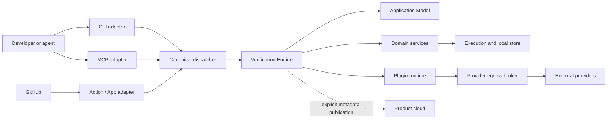

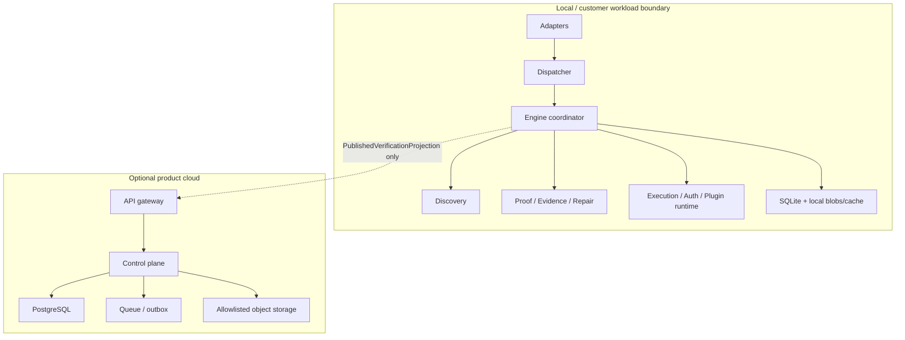

The canonical lifecycle is Preflight → Discovery plan → Discover → Resolve →
Seal → Plan → Authorize → Execute → Capture → Evaluate → Repair → Report.
Every stage declares inputs, outputs, budgets, cancellation, events, errors, and
an atomic commit unit.

## 6. Application Model

The Application Model is a sealed graph of Applications, Capabilities, Promises,
Proof definitions, `PromiseProofBinding` associations, Evidence requirements,
Provider bindings, Repair Knowledge, configuration, policy, and provenance.

```ts
type OpaqueId = string;
type Sha256Digest = `sha256:${string}`;
type Rfc3339Utc = string;
type Ratio = number; // schema-enforced 0..1

interface RevisionRef {
  kind: DomainObjectKind;
  id: OpaqueId;
  revision: Sha256Digest;
  schemaVersion: number;
}

interface ApplicationModel {
  id: OpaqueId;
  revision: Sha256Digest;
  schemaVersion: number;
  applications: readonly RevisionRef[];
  capabilities: readonly RevisionRef[];
  promises: readonly RevisionRef[];
  proofs: readonly RevisionRef[];
  promiseProofBindings: readonly RevisionRef[];
  providerBindings: readonly RevisionRef[];
  repairKnowledge: readonly RevisionRef[];
  policyRevision?: RevisionRef;
  configurationRevision?: RevisionRef;
  provenance: readonly ProvenanceRecord[];
}

interface PromiseProofBinding {
  id: OpaqueId;
  revision: Sha256Digest;
  promise: RevisionRef;
  proof: RevisionRef;
  requirement: "required" | "advisory";
  order: number;
  applicability: ApplicabilityExpression;
  provenance: readonly ProvenanceRecord[];
}
```

Promise and Proof payloads never exact-reference each other. The binding object
removes the content-hash cycle identified by red-team review. The model rejects
dangling, duplicate, cross-scope, and dependency-cyclic bindings.

`SemanticIdDeriver` uses versioned stable natural keys from Shared Contracts.
`EphemeralIdSource` owns invocation, attempt, event, and transport IDs. Random
IDs never enter semantic revision preimages.

## 7. Repository Discovery

Discovery is passive, bounded, read-only, deterministic, offline, and
cancellable. Preflight binds the workspace and safety policy. Engine-native
readers inspect ordinary files only; no modules, executable config, scripts,
package manager, archives, other processes, registry, or network are invoked.

```ts
interface DiscoveryResult {
  schemaVersion: number;
  workspaceBinding: OpaqueId;
  signals: readonly DiscoverySignal[];
  facts: readonly DiscoveryFact[];
  candidates: readonly ModelCandidate[];
  conflicts: readonly DiscoveryConflict[];
  skipped: readonly SkippedInput[];
  limits: DiscoveryLimits;
  completion: "complete" | "bounded" | "cancelled" | "error";
  diagnostics: readonly StructuredError[];
}
```

MVP readers support bounded JSON parsing for `package.json`, npm lockfile
ownership, `pnpm-workspace.yaml` through a non-executable data parser, pnpm
lockfile ownership, and Yarn workspace/lockfile signals. Losing facts remain
attributable. Unsupported repositories return `not_evaluated` with discovered
facts and the supported-ecosystem list—never a dead-end plugin instruction.

Default limits: 100,000 files, 256 MiB inspected bytes, 2 MiB per ordinary file,
10,000 manifests, 30 seconds, depth 64, and no out-of-root symlink traversal.
Policy may lower them; increases are capped at ten times the default.

## 8. Capability Model

```ts
interface Capability {
  id: OpaqueId;
  revision: Sha256Digest;
  schemaVersion: number;
  application: RevisionRef;
  type: string;
  scope: ScopeRef;
  activation: "candidate" | "active" | "retired";
  confidence: Confidence;
  provenance: readonly ProvenanceRecord[];
  extensions: readonly ExtensionEntry[];
}

interface Confidence {
  value: Ratio;
  basis: "declared" | "policy" | "deterministic_rule" | "heuristic";
  ruleId: string;
  signalRefs: readonly OpaqueId[];
}
```

Confidence describes discovery inference only. It never weights, replaces, or
changes a Proof verdict. MVP activates one capability family:
`workspace.dependencyIntegrity`.

## 9. Promise Model

```ts
interface PromiseDefinition {
  id: OpaqueId;
  revision: Sha256Digest;
  schemaVersion: number;
  subject: RevisionRef;
  capability: RevisionRef;
  predicate: PredicateExpression;
  expected: CanonicalValue;
  criticality: "required" | "advisory";
  provenanceKind: "declared" | "policy" | "discovered";
  applicability: ApplicabilityExpression;
  owner?: string;
}
```

MVP Promise predicates cover manifest structural validity, unique in-boundary
workspace membership, unambiguous local dependency references, and one
lockfile ownership scope. Activation rules are versioned Engine data. A Promise
without an applicable required binding is indeterminate.

Aggregation uses one effective attempt per required binding and one sealed
model/execution context: every pass is `satisfied`; any fail is `violated`; all
other combinations are `indeterminate`.

## 10. Proof Engine

```ts
interface ProofDefinition {
  id: OpaqueId;
  revision: Sha256Digest;
  schemaVersion: number;
  evaluator: ProducerRef;
  predicateLanguage: SchemaRef;
  inputs: readonly InputRequirement[];
  evidenceRequirements: readonly EvidenceRequirement[];
  dependencies: readonly RevisionRef[];
  permissions: PermissionRequest;
  reproducibility: "hermetic" | "replayable" | "observational";
  cachePolicy: CachePolicy;
  timeoutMs: number;
  retryPolicy: RetryPolicy;
}

type ProofLifecycleState =
  | "queued" | "running" | "passed" | "failed"
  | "indeterminate" | "error" | "cancelled";

interface ProofExecution {
  attemptId: OpaqueId;
  attemptRef: ProofAttemptRef;
  proof: RevisionRef;
  model: RevisionRef;
  executionContext: RevisionRef;
  planKey: Sha256Digest;
  state: ProofLifecycleState;
  effective: boolean;
  startedAt?: Rfc3339Utc;
  completedAt?: Rfc3339Utc;
  evidence: readonly RevisionRef[];
  result?: ProofResult;
  resultDigest?: Sha256Digest;
  attemptRecordDigest?: Sha256Digest;
}

type ProofResult =
  | { status: "passed"; evidence: readonly RevisionRef[] }
  | { status: "failed"; evidence: readonly RevisionRef[]; reasonCodes: readonly string[] }
  | { status: "indeterminate"; reasonCodes: readonly string[]; evidence: readonly RevisionRef[] }
  | { status: "error"; error: StructuredError }
  | { status: "cancelled"; reason: "caller" | "deadline" | "shutdown" };
```

The provider-neutral predicate AST and evaluator registry are owned by
`contracts` and `proofs`. Plugins may use only installed supported revisions.
Adding an operator requires two provider-neutral uses and ADR review when it
changes frozen semantics.

Valid but insufficient Evidence yields `indeterminate/completed`. Failure of a
required authorization, sandbox, plugin, persistence, redaction, auth, or
environment control yields attempt `error` and command `blocked`. User/deadline
cancellation yields `cancelled`. Advisory-only failure remains a diagnostic.

Only retry-safe `error` may retry. Pass, fail, indeterminate, and cancellation
never retry to seek a different verdict. Deadline bounds the entire invocation;
each attempt receives the remaining budget. Cancellation propagates within one
second and prevents cache publication.

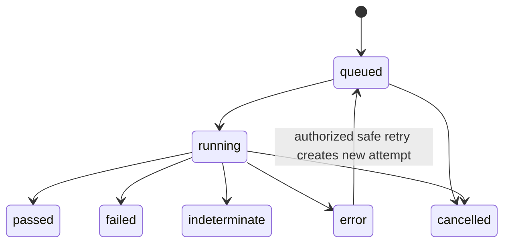

## 11. Evidence Engine

```ts
interface Evidence {
  id: OpaqueId;
  revision: Sha256Digest;
  schemaVersion: number;
  evidenceType: string;
  mediaType: string;
  producer: ProducerRef;
  capturedAt: Rfc3339Utc;
  attempt: ProofAttemptRef;
  subjects: readonly RevisionRef[];
  inputRefs: readonly RevisionRef[];
  contentDigest: Sha256Digest;
  byteSize: number;
  classification: DataClassification;
  chainOfCustody: readonly CustodyStep[];
  supersedes: readonly RevisionRef[];
}
```

Evidence capture, its event, and exact attempt edge commit atomically. Validation
is a separate immutable event committed before a terminal pass/fail. Raw source
is not retained by default; MVP Evidence stores normalized bounded observations,
structured pointers, content identity, and provenance.

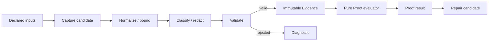

`resultDigest` excludes attempt/capture wall-clock identity; a separate complete
attempt digest retains it. Interface parity compares one retained invocation.
Reexecution determinism compares stable model, plan, evaluator, observation
content, verdict, reason, and order without pretending capture times or Evidence
revisions are identical.

## 12. Repair Engine

```ts
interface RepairSuggestion {
  id: OpaqueId;
  revision: Sha256Digest;
  schemaVersion: number;
  motivatingPromise: RevisionRef;
  motivatingExecution: ProofAttemptRef;
  evidence: readonly RevisionRef[];
  generator: ProducerRef;
  action: RepairAction;
  assumptions: readonly string[];
  requiredPermissions: PermissionRequest;
  expectedEffect: string;
  confidence: Confidence;
  verificationPlan: RevisionRef;
}
```

MVP Repairs are deterministic advisory edits for workspace declarations and
local dependency references. They include exact motivating revisions and a
later Proof plan. MVP does not write. Post-MVP `applyRepair` is a separate
command with preview, explicit write grant, conflict detection, atomic patch,
event, and later verification invocation. An LLM may propose or rank only after
Evidence citation; it never determines status.

## 13. Provider Plugin SDK

```ts
interface ProviderPlugin {
  manifest: ProviderPluginManifest;
  handshake(request: PluginHandshakeRequest): PluginHandshakeResponse;
  discover?(
    request: DiscoveryPluginRequest,
    context: ExecutionContext
  ): AsyncIterable<DiscoveryContribution>;
  describeProofs?(
    request: DescribeProofsRequest,
    context: ExecutionContext
  ): AsyncIterable<ProofContribution>;
  captureEvidence?(
    request: CaptureEvidenceRequest,
    context: ExecutionContext
  ): AsyncIterable<EvidenceCandidate>;
  suggestRepairs?(
    request: SuggestRepairsRequest,
    context: ExecutionContext
  ): AsyncIterable<RepairCandidate>;
}

interface ExecutionContext {
  invocationId: OpaqueId;
  attemptId: OpaqueId;
  applicationModel: RevisionRef;
  operationId: string;
  deadline: Rfc3339Utc;
  cancellationRequestId: OpaqueId;
  grantedPermissions: EffectivePermissionGrant;
  secretReferences: readonly SecretReference[];
  enforcementTier: string;
  locale: "en-US-POSIX";
  timezone: "UTC";
}
```

Fresh child processes communicate through versioned NDJSON. Manifest maximum
permissions are not grants. Effective consent shows exact roots, broker
destinations, outbound classes/bytes, secret audience/scopes, side effects,
duration, denied differences, and enforcement tier.

Engine-native discovery uses `passive-engine`; discovery plugins use
`local-restricted` with network, secret, subprocess, write, and out-of-root
denied. No discovery plugin ships before OS sandbox ADR D-001.

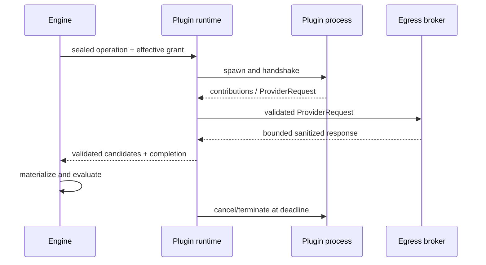

## 14. Built-In Provider Strategy

The first public CLI contains Engine-native static readers, not provider
plugins. The plugin-platform milestone first passes three synthetic providers
with different auth, latency, error, and cancellation behavior.

The first external pilot is read-only GitHub repository-policy configuration:
default branch, required checks, review requirements, and branch
protection/rulesets. Pull-request state, mutations, source annotations, generic
HTTPS, and executable provider Repairs are deferred.

First-party plugins use the public contract, same process boundary, permissions,
signing, and conformance suite. No hidden in-process path exists.

## 15. CLI Architecture and UX

MVP commands:

- `verify` — discover, model, prove, capture, suggest, report;
- `inspect run <id>` — read retained canonical history without reevaluation;
- `inspect evidence <id>` — authorized local Evidence projection;
- `cache inspect` and `cache clear`;
- `version` and `schema`.

Human output leads with operational status and outcome, then required Promises,
Evidence references, and next actions. JSON emits one document; JSONL emits
events then exactly one terminal result. Machine modes never prompt. Interactive
permission requests show the exact effective plan; non-interactive runs require
an external policy grant.

Exit mapping is frozen: satisfied 0, violated 1, indeterminate/not-evaluated 2,
invalid 3, blocked 4, cancelled 5, internal/incompatible 6.

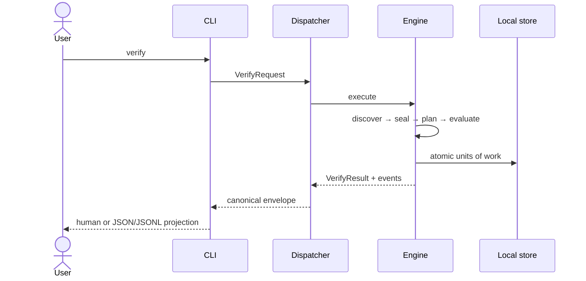

## 16. Structured JSON Protocol

All commands use the common envelope defined in Freeze §12. Stable result kinds
include `verify`, `dispatchVerification`, `publishedVerification`, `getRun`,
and `getPublishedRun`.

```ts
interface StructuredError {
  code: `VFY_${string}`;
  category:
    | "invalid" | "permission" | "authentication" | "environment"
    | "plugin" | "network" | "integrity" | "compatibility"
    | "resource" | "internal";
  retryability: "never" | "safe" | "policy_required";
  message: string;
  remediation?: string;
  component: string;
  operation: string;
  blocksRequiredProof: boolean;
  causes: readonly StructuredError[];
  diagnosticRefs: readonly RevisionRef[];
}

interface SecretReference {
  id: OpaqueId;
  binding: OpaqueId;
  audience: string;
  scopes: readonly string[];
  generationFingerprint?: string;
}
```

Missing separately grantable consent uses `policy_required`; non-overridable
Engine or organization denial uses `never`. Provider-native codes are sanitized
details only.

Schema majors are positive integers independent of Engine SemVer. Additive
optional fields are compatible. Unknown informational fields are ignored;
unknown control-flow values produce incompatible result and never success.

## 17. MCP Server

Local MCP exposes `verification.verify`, `verification.get_run`,
`verification.get_evidence`, `verification.inspect_permissions`, and read-only
schema/glossary resources. Tool inputs are canonical request schemas; outputs
are canonical envelopes. The server binds one explicit workspace and propagates
deadline and cancellation to the Engine.

Remote MCP does not expose a privacy-reduced object as `verify`. It exposes
`dispatch_verification` and `get_published_run`. A dispatch receipt owns routing
states; only the customer workload owns the terminal Verify Result.

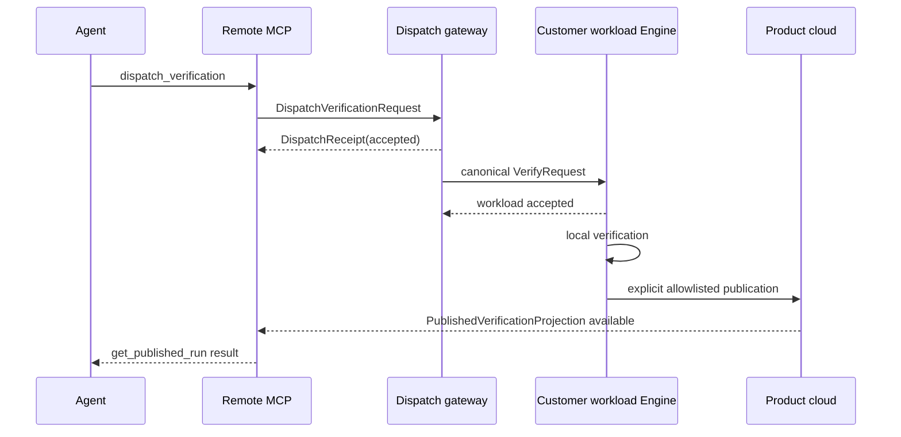

Dispatch cancellation has separate requested, forwarded, workload-accepted, and
workload-terminal acknowledgements. A gateway cannot claim Engine cancellation.

## 18. GitHub App and GitHub Actions

The GitHub Action runs the canonical CLI/Engine in the repository's existing
workflow boundary and projects the retained local result. The GitHub App handles
installation identity, dispatch, published metadata, and check presentation; it
does not clone source or execute verification by default.

Phase-one check data is limited to status, stable reason codes, counts, duration,
classifications, opaque publication IDs, and a non-sensitive application alias.
No filenames, Promise prose, locations, annotations containing source, commands,
logs, or raw revisions cross by default. `internal_error` maps to GitHub
`action_required` as transport presentation, not domain meaning.

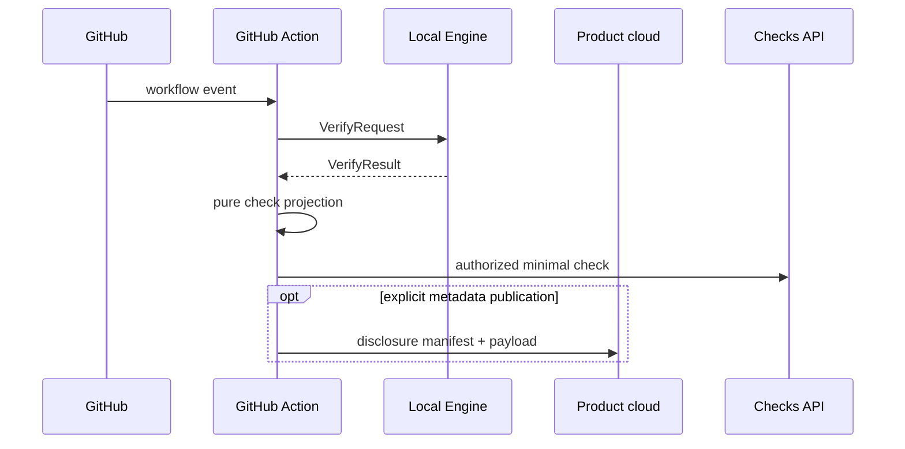

The read-only GitHub provider plugin is separate from Action/App adapters.

## 19. Cloud Architecture

Cloud adds team history, signed policy distribution, metadata publication, and
remote workload coordination. It is not required for local work.

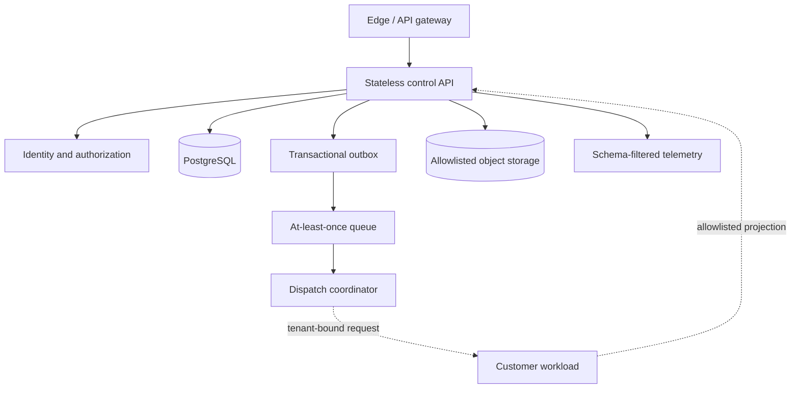

The first cloud milestone stores exactly Freeze §11.3 fields. Physical tables
must not add attempt history, effective attempt, reproducibility class, media
type, validation state, Promise text, locations, commands, or raw revisions.
Suppressed detail is represented by counts and local inspection guidance.

Product-hosted source execution is not authorized. ADR-0008 selects
customer-controlled workloads first.

## 20. Execution Workers and Queues

Local work uses a bounded deterministic DAG scheduler. Remote dispatch uses
durable admission plus an at-least-once broker. Queue delivery is not a Proof
attempt.

Admission transaction creates dispatch record, idempotency record, and outbox
event. Workers claim with a fenced lease, heartbeat, and expiry. A stale fence
cannot finalize. Transport retries are idempotent and do not create hidden Proof
attempts; the Engine alone owns Proof retry policy.

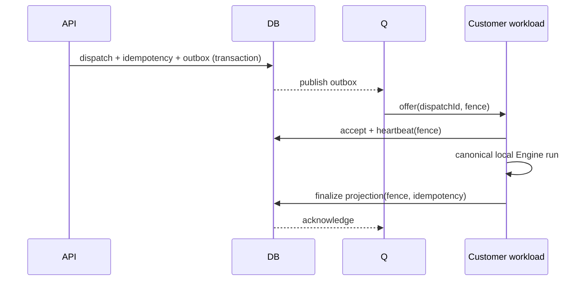

Overload rejects before admission with retry metadata. Per-tenant quotas,
global queue age, attempts, payload, and concurrency are bounded.

## 21. Persistence and Database Schema

MVP uses ADR-0003: SQLite/WAL for metadata and events, content-addressed local
files for permitted Evidence bodies, and a separate cache directory.
`EngineUnitOfWork` provides atomic visibility for every lifecycle unit.

Cloud uses ADR-0005: PostgreSQL-compatible storage, object storage only for
explicitly authorized payloads, transactional outbox, and fenced async work.

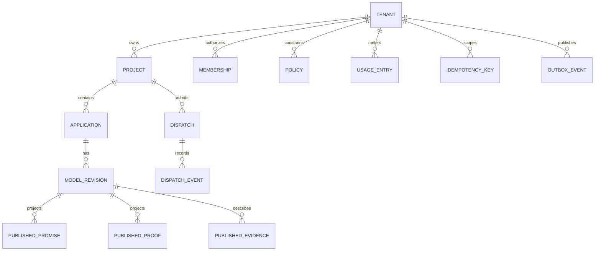

Every cloud row has tenant ID in key and query. Publication tables contain
opaque locally keyed publication IDs, permitted statuses/reasons/counts/
durations, and Evidence type/size/class only.

Migrations use expand → dual-compatible read/write when required → backfill →
verify → contract. Local migrations back up first and never downgrade in place.

## 22. Event Model

```ts
interface EventEnvelope<TType extends string, TPayload> {
  schemaVersion: number;
  eventId: OpaqueId;
  eventType: TType;
  occurredAt: Rfc3339Utc;
  invocationId: OpaqueId;
  subject?: RevisionRef;
  causationId?: OpaqueId;
  correlationId: OpaqueId;
  sequence: number;
  producer: ProducerRef;
  dataClassification: DataClassification;
  payload: TPayload;
}
```

Events are past-tense facts. Every canonical command receives an invocation ID;
long-lived jobs also receive an operation correlation ID. Event names and
payload schemas live in a registry. Unknown informational events may be ignored;
unknown reconstruction-critical events fail compatibility.

State changes are append-only events committed with their referenced objects in
one Engine unit of work. Audit events are redacted at creation.

## 23. REST API and OpenAPI

REST is `/v1`, JSON, cursor-paginated, tenant-authorized, idempotent for
mutation/publication, and generated from the same source schemas as CLI/MCP.
OpenAPI is generated and diffed in CI.

External resources:

- `POST /v1/dispatches` → `DispatchVerificationResult`;
- `POST /v1/dispatches/{id}/cancellations`;
- `GET /v1/dispatches/{id}`;
- `POST /v1/publications` with disclosure manifest and idempotency key;
- `GET /v1/published-runs/{id}`;
- `GET /v1/projects`, `/applications`, and `/policies`;
- `POST /v1/policies:resolve` only as a typed action subresource.

HTTP transport success means a valid canonical envelope was obtained, not that a
Promise passed. Auth/routing/retrieval failures use their own command result;
they never mutate a retained Verify Result.

## 24. Authentication and Authorization

Local-only use needs no product identity. Human cloud login uses public-client
OAuth/OIDC with PKCE or device flow and short-lived audience tokens. Workloads
use separately revocable scoped identities. Product and provider credentials
are separate trust domains.

Authorization evaluates principal + action + tenant + exact resource +
conditions, server-side, default deny. Initial actions:

`project:read`, `dispatch:create`, `dispatch:cancel`, `run:publish`,
`run:readPublished`, `policy:read`, `policy:admin`, `membership:admin`,
`deletion:request`, and `usage:read`.

Role names are bundles, not enforcement inputs. Operator access is just-in-time,
reason-bound, expiring, and audited. Cross-tenant negative fixtures exist for
every API, queue, cache, object, export, and support path.

## 25. Secrets and Credential Handling

Secrets never enter the Application Model.

`SecretReference` identifies a broker binding, audience, scopes, and optional
non-reversible generation fingerprint. At execution, policy authorizes the exact
operation, then the broker grants an invocation-scoped handle or attaches the
secret inside the Engine-owned provider egress broker.

Secrets never enter argv, environment dumps, process titles, protocol messages,
Evidence, logs, errors, cache keys, semantic digests, analytics, or cloud.
Cancellation and process exit revoke the grant. Canary tests cover every sink.
Per-platform delivery remains a plugin milestone gate, not an MVP dependency.

## 26. Privacy and Data Minimization

Data classes are `SECRET`, `LOCAL_SOURCE`, `SENSITIVE_EVIDENCE`,
`MINIMAL_METADATA`, and `EXPLICIT_SHARE`. Unknown fields fail upload.

Default product-cloud publication contains only:

- schema, purpose, tenant/project destination, opaque run/idempotency IDs;
- public Engine/protocol/plugin artifact identity;
- locally keyed tenant/object publication IDs;
- Promise/Proof statuses and stable reason codes;
- aggregate counts and durations;
- Evidence type, byte size, publication ID, and sensitivity class;
- non-sensitive application alias, audit correlation, retention class.

Provider egress is separately authorized. Plugins use the Engine broker, which
owns DNS, redirects, destinations, credential attachment, request/response
bounds, data-class schema, redaction, audit, and cancellation.

Retention deletion removes payloads and leaves a minimal tombstone; traversal
returns `deleted_reference`. Secondary sinks, replicas, backups, exports, and
indexes are in the deletion inventory.

## 27. Threat Model

Adversaries include malicious repositories, compromised plugins/tools,
credential thieves, hostile providers, confused-deputy adapters, cross-tenant
actors, supply-chain compromise, and abusive workloads. Root/kernel and arbitrary
same-user compromise are outside local claims unless stronger isolation proves
otherwise.

Primary threats and controls:

| Threat | Control |
|---|---|
| Discovery code execution/path escape | Passive parsers, ordinary-file safe open, root binding, limits |
| Command/argument injection | argv-only execution; no shell |
| Plugin exfiltration | OS sandbox gate, no raw network, egress broker, canaries |
| Secret leak | broker references, scoped grants, ingestion/pre-sink redaction |
| Cache poisoning | complete contextual key, integrity, atomic publish |
| Forged Evidence | producer identity, content digest, custody, validation |
| Cross-tenant access | tenant-keyed queries/resources and negative tests |
| Queue duplicate/stale worker | idempotency and fenced lease |
| Cloud shadow copies | schema-filtered logs/traces and data-flow inventory |
| Supply-chain substitution | pinning, signatures/provenance, SBOM, revocation |

Dynamic plugins remain unavailable until sandbox, signing/revocation, secret
delivery, and egress gates pass. Product-hosted source remains unavailable.

## 28. Telemetry and Observability

Local audit works offline. Telemetry is off by default. Human logs and optional
OpenTelemetry export derive from the same redacted event stream; exporter
failure never changes verification.

Cloud operational telemetry contains service-level metrics and opaque tenant
dimensions only where necessary. It excludes filenames, source, commands,
Evidence bodies, prompts, environment, secrets, and Promise prose.

Required signals: request rate/error/duration, dispatch admission and queue age,
lease loss, worker acknowledgement, database/object failures, publication
rejection, redaction failure, deletion backlog, usage reconciliation, and SLO
burn.

## 29. Reliability and Failure Recovery

Local startup detects abandoned invocations, quarantines incomplete artifacts,
reconciles surviving children, verifies SQLite/blob integrity, and never infers
success. Power-loss tests surround every write in each atomic unit.

Initial hosted targets, once measured:

- API and published-run reads: 99.9% monthly availability;
- accepted dispatch durability: 99.99%;
- p95 control API under 500 ms excluding workload execution;
- authoritative PostgreSQL RPO ≤ 5 minutes, RTO ≤ 4 hours;
- publication object RPO ≤ 15 minutes, RTO ≤ 8 hours.

These are design targets, not current product claims. Overload, cloud outage,
and publication failure preserve completed local results.

## 30. Billing and Usage Metering

MVP has no billing or usage upload. Before hosted commercial use, a separate
append-only usage ledger—not telemetry—records tenant, meter, quantity, unit,
source operation, idempotency, reservation/finalization, and correction links.

Meters may include accepted dispatches, customer-workload coordination,
published metadata storage byte-days, and future explicitly authorized hosted
compute. Platform-failed or duplicate work is not billed. Corrections append;
they never rewrite. Pricing, allowance, payment, tax, refund, and dunning remain
F-003 founder/business scope.

## 31. Scalability and Cost Controls

MVP defaults:

| Resource | Default | Hard policy ceiling |
|---|---:|---:|
| Files inspected | 100,000 | 1,000,000 |
| Discovery input bytes | 256 MiB | 2 GiB |
| Ordinary file bytes | 2 MiB | 16 MiB |
| Concurrent local invocations | 2 | 8 |
| Machine output per invocation | 16 MiB | 64 MiB |
| Scratch/quarantine | 256 MiB / 24 h | 2 GiB / 7 d |
| Local run history | 200 runs or 30 d | 2,000 runs or 365 d |
| Retained Evidence bodies | 256 MiB | 2 GiB |
| Cache | 1 GiB | 10 GiB |

Default retention is an explicit local policy. Expiry creates deletion
tombstones where graph edges require them; authoritative facts are never
silently evicted as cache. At a hard storage limit, new durable work becomes
blocked before execution rather than dropping required Evidence.

Hosted admission bounds tenant quotas, payloads, queue age, retries,
concurrency, retention, and provider calls. No dimension is unbounded.

## 32. Monorepo and Package Structure

```text
packages/
  contracts/       events/          discovery/
  proofs/          evidence/        repair/
  execution/       auth/            plugin-sdk/
  plugin-runtime/  engine/          protocol/
  cloud-client/
apps/
  cli/             mcp/             github-action/
  github-app/      cloud-api/       dispatch-coordinator/
tooling/
  architecture/    schema/          conformance/
  fixtures/        release/         security/
```

MVP creates only `contracts`, `events`, `discovery`, `proofs`, `evidence`,
`repair`, `execution`, `auth`, `engine`, `protocol`, `apps/cli`, and required
tooling. No empty cloud/plugin/integration packages are scaffolded.

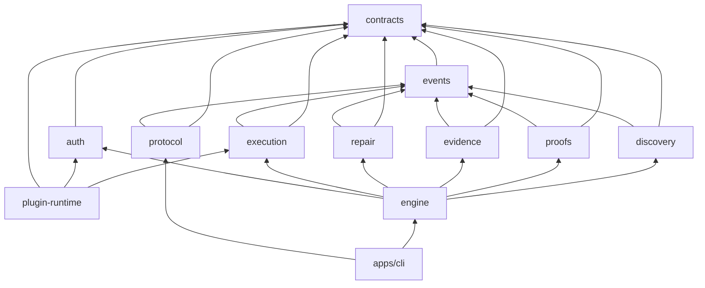

Cycles, deep imports, app-to-package reverse edges, provider SDKs in core, and
network clients in offline packages fail static checks. Proof definitions and
`PromiseProofBinding` construction precede Promise activation and model sealing.

## 33. Testing Strategy

Testing layers include schema vectors, property tests, golden repositories,
state-machine models, power-loss fault injection, adapter projection parity,
synthetic providers, security canaries, compatibility matrices, performance
corpora, and release artifact inspection.

The MVP corpus includes empty, unknown, npm, pnpm, Yarn, nested monorepo,
conflicting workspaces, multiple lockfiles, malformed/duplicate-key data, huge
tree, Unicode/case collision, symlink/special file, dirty/mutating worktree,
offline, cancellation, corruption, cache hit/miss/bypass, and deterministic
Repair re-verification.

Each frozen `MUST` maps to a test/static/manual control ID. Flaky gates fail.

## 34. Performance Requirements

On published reference hardware:

- warm passive discovery of 100,000 files: p95 ≤ 5 s;
- Engine overhead excluding external tools: p95 ≤ 1 s;
- cancellation begins termination within 1 s;
- first progress event ≤ 250 ms;
- healthy cache lookup p95 ≤ 50 ms;
- no network when offline;
- memory stays below the published reference bound.

Reports record cold/warm state, repository shape, file/byte count, OS,
filesystem, CPU/memory, runtime, artifact digests, sample count, median, p95,
max, and failures. Performance never weakens Evidence, redaction, or isolation.

## 35. Open-Source and Closed-Source Boundaries

ADR-0009 selects an open-core technical boundary, conditional on F-002.

Intended public: contracts/schemas, events, discovery, Proof/Evidence/Repair,
local execution/cache, auth ports, Engine, protocol, plugin SDK/runtime, CLI,
local MCP, synthetic plugins, and conformance fixtures.

Intended private: product cloud server implementations, tenant administration,
billing, managed dispatch, product-operated workers, and proprietary provider
plugins. Client-consumed cloud schemas remain public. Closed components receive
no semantic or security exception.

Until founder/legal approves a license, the repository remains private.

## 36. MVP Scope

The first public local CLI includes:

- passive npm/pnpm/Yarn repository discovery;
- Application/Capability/Promise/Proof/Binding model sealing;
- four workspace-integrity predicates;
- validated structured Evidence and exact provenance;
- deterministic advisory Repairs without writes;
- local SQLite/blob history and bounded cache;
- human, JSON, and JSONL output;
- inspect/cache commands;
- offline, security, compatibility, and release conformance.

It excludes repository commands, plugins, providers, Repair application, cloud,
MCP, GitHub, REST, hosted workers, billing, LLMs, enterprise controls, other
ecosystems, and runtime/deployment promises.

MVP success means a coding agent can consume one violated Promise, traverse its
Proof and Evidence, select the deterministic Repair, and verify a later run
without parsing prose.

## 37. Deferred Scope

Post-MVP order:

1. Repair inspect/apply/re-verify with explicit writes.
2. Plugin runtime after security gates and three synthetic plugins.
3. Narrow read-only GitHub repository-policy provider.
4. Local MCP adapter.
5. GitHub Action projection.
6. Optional metadata cloud and customer-workload dispatch.
7. GitHub App over published projections.

Long-term: other ecosystems, observational providers, policy distribution,
attestations, LLM-assisted Repair, enterprise controls, commercial metering,
and—only after a new explicit-share ADR—product-hosted source execution.

## 38. Risks and Mitigations

| Risk | Mitigation |
|---|---|
| Narrow MVP appears trivial | Demonstrate full traceable loop and agent repair value |
| Static identity drifts | Versioned derivation and fresh-store/moved-repo tests |
| Persistence splits truth | EngineUnitOfWork and power-loss fixtures |
| Plugin sandbox unavailable | Feature unavailable; no degraded claim |
| Provider SDK bypasses egress | Broker-only network and hostile SDK tests |
| Cloud leaks local data | Literal allowlist in schemas and physical tables |
| Integrations invent status | Distinct result kinds and pure projectors |
| Local disk growth | Numeric retention/quotas and fail-before-execution |
| Provider-specific core pressure | Predicate registry and ADR rule |
| Hosted product becomes CI | Customer workload first; product workers prohibited |
| Compatibility freezes mistakes | Golden schemas and previous-major readers |

No blocking red-team finding remains in MVP architecture. Plugin and
product-hosted blockers are explicit unavailable feature gates.

## 39. Implementation Roadmap

Detailed agent-sized tasks live in [ROADMAP.md](../product/ROADMAP.md). Order:

1. repository guardrails and schema generation;
2. canonical revisions, bindings, errors, events, and results;
3. passive discovery and model sealing;
4. Evidence, pure evaluators, and aggregation;
5. atomic persistence, cache, scheduler ports, and advisory Repair;
6. canonical CLI and npm release Evidence;
7. Repair application;
8. plugin platform and synthetic providers;
9. GitHub provider and local integrations;
10. metadata cloud and customer-workload dispatch.

Critical path:

```text
boundary rules
→ canonical codec
→ revision + PromiseProofBinding schemas
→ passive readers
→ model validator/sealer
→ Evidence validation
→ first evaluator
→ aggregation
→ EngineUnitOfWork
→ CLI JSON
```

Recommended first task: M0-T01, create the workspace ownership inventory and
architecture dependency rule corpus, followed by the canonical codec.

## 40. Architecture Decision Records

1. [ADR-0001](ADR/0001-canonical-engine-and-interface-projections.md) — one
   Engine and pure projections.
2. [ADR-0002](ADR/0002-monorepo-package-boundaries.md) — monorepo boundaries.
3. [ADR-0003](ADR/0003-local-persistence.md) — SQLite, blobs, cache.
4. [ADR-0004](ADR/0004-plugin-runtime-and-egress-broker.md) — child process and
   brokered network.
5. [ADR-0005](ADR/0005-cloud-persistence-and-queue-semantics.md) — PostgreSQL,
   outbox, fenced at-least-once work.
6. [ADR-0006](ADR/0006-passive-workspace-integrity-mvp.md) — passive JS/TS MVP.
7. [ADR-0007](ADR/0007-remote-dispatch-and-publication-results.md) — split
   remote result kinds.
8. [ADR-0008](ADR/0008-customer-controlled-hosted-execution-first.md) —
   customer workload before product-hosted source.
9. [ADR-0009](ADR/0009-open-core-source-boundary.md) — technical open-core
   boundary pending license.
10. [ADR-0010](ADR/0010-promise-proof-binding-and-revision-graph.md) — immutable
    Promise-Proof association.

Pre-feature gates remain in [OPEN_QUESTIONS.md](OPEN_QUESTIONS.md). They do not
block the first public local CLI.
