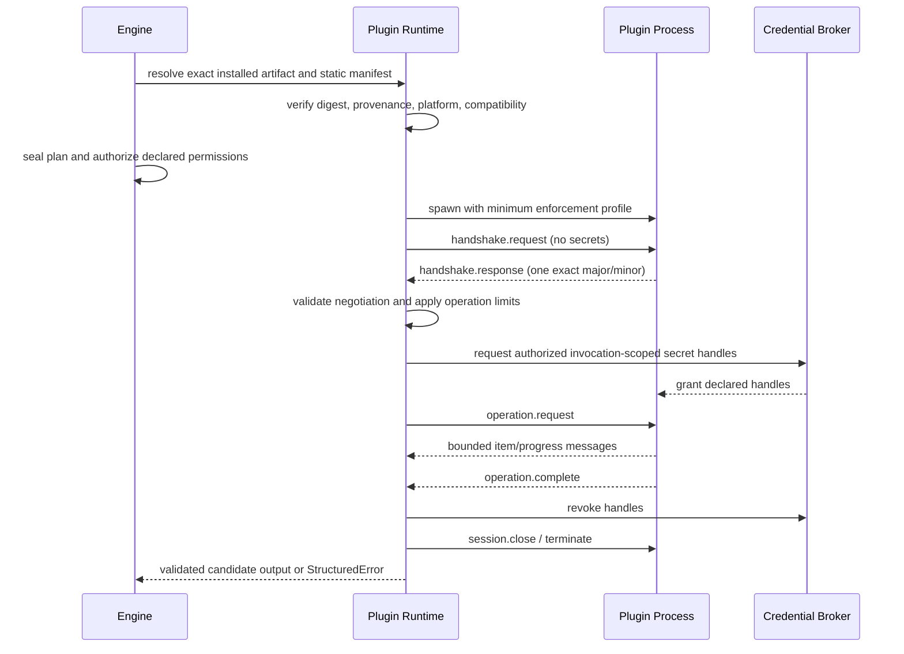

# Plugin Platform Draft

**Status:** Domain draft; non-canonical until reconciled into the EDD
**Owner:** Plugin Platform
**Governing authority:** Architecture Freeze §§3, 5.9, 6–10, 11.5, 13, 14,
17–18; Glossary; Shared Contracts
**Scope:** Provider Plugin SDK, plugin packaging and runtime contract, provider
onboarding, and provider-neutral extension points

## 1. Purpose and constraints

The plugin platform lets provider-specific behavior participate in verification
without entering the engine. The engine remains the sole semantic authority.
Plugins supply attributed discovery facts, provider bindings, Evidence
candidates, declarative Proof implementations, versioned Repair Knowledge, and
normalized operational reasons. The engine owns authorization, scheduling,
Evidence materialization and validation, Proof evaluation, Promise aggregation,
Repair lifecycle, persistence, cache policy, audit, and result serialization.

This chapter does not redefine Application Model, Capability, Promise, Proof,
Evidence, Repair, Provider binding, Authentication, or the Cloud Boundary.
Plugin-returned data becomes authoritative only through the applicable engine
validation and lifecycle step.

The design has these non-negotiable properties:

- adding a provider does not modify or recompile core;
- core contains no provider SDK, provider-name branch, credential lookup, or
  provider-specific schema interpretation;
- all plugins, including first-party plugins, use the same out-of-process
  contract and conformance suite;
- installation, selection, authorization, and execution are distinct decisions;
- source, secret, network, process, write, and publication authority are denied
  unless independently granted for the exact operation;
- a plugin never emits a final Promise status and never bypasses the engine's
  Evidence, Repair, policy, cache, redaction, audit, or cloud controls.

## 2. Component ownership

| Component | Owns | Must not own |
|---|---|---|
| `plugin-sdk` | Provider-facing TypeScript declarations, schemas, generated bindings, fixtures, SDK compatibility helpers | Process launch, credentials, provider SDKs, engine services |
| `plugin-runtime` | Installed plugin resolution, manifest validation, compatibility negotiation, process lifecycle, protocol framing, limits, containment, diagnostics | Proof semantics, Promise aggregation, provider-specific logic |
| `auth` | Secret references, authorization decisions, invocation-scoped credential grants | Provider discovery or provider API calls |
| `execution` | Sealed plans, sandbox profile, scheduler, deadlines, cancellation, retry attempts, resource accounting | Plugin-specific retry decisions |
| `evidence` | Candidate normalization, classification, redaction, integrity, lifecycle, identity and provenance | Provider API behavior |
| `repair` | Repair candidate validation, immutable Repair creation and lifecycle | Automatic acceptance or unverified success |
| provider package | Static manifest, provider adapter, extension schemas, provider SDK dependency, conformance fixtures | Core status values, aggregate verdicts, global credential access |

`plugin-sdk` depends only on `contracts`. `plugin-runtime` depends only on the
packages allowed by `SHARED_CONTRACTS.md`. Provider packages depend on the
published Plugin Contract and their provider libraries; no core package depends
on a provider package.

## 3. Artifact and installation model

A plugin is an immutable executable artifact plus a static manifest and
publisher provenance. The install record binds:

- canonical plugin identity (`namespace/pluginId`);
- implementation version;
- artifact digest;
- manifest digest;
- publisher and source provenance;
- installation source and time as metadata;
- local enabled/disabled state;
- verification status and any security revocation.

The manifest is read and verified without executing plugin code. A manifest
embedded only behind an executable `describe` command is insufficient because
compatibility and permissions must be known before process launch.

Resolution uses only already-installed, version-pinned artifacts during a run.
Registry access, update checks, floating version resolution, and silent
replacement are prohibited in invocation preflight. Newly installed or updated
code cannot enter an already-sealed invocation. Artifact digest, manifest
digest, exact revision, and effective OS enforcement tier are recorded in every
attempt.

Installation proves neither trust nor permission. Runtime authority is computed
per operation from the intersection of:

```text
engine hard limits
∩ signed organization policy
∩ external user or CI grants
∩ sealed execution plan
∩ plugin manifest declarations
```

Workspace content may select or request an installed plugin but cannot install
code, elevate it, accept degraded isolation, or grant it secrets, network,
process execution, writes, source disclosure, or publication authority.

## 4. Static manifest contract

The SDK publishes a schema for this manifest. The schema is independently
versioned from both the engine and protocol.

```ts
type PluginId = `${string}/${string}`;
type SemVer = string;
type ArtifactDigest = `sha256:${string}`;

interface ProviderPluginManifest {
  manifestSchemaVersion: 1;
  pluginId: PluginId;
  implementationVersion: SemVer;
  artifactDigest: ArtifactDigest;
  publisher: {
    publisherId: string;
    sourceUri?: string;
    provenanceUri?: string;
    signature?: {
      scheme: string;
      keyId: string;
      value: string;
    };
  };
  pluginContract: {
    majors: readonly PluginMajorSupport[];
    compatibleEngineRange: string;
  };
  entrypoint: {
    executable: string;
    fixedArguments: readonly string[];
  };
  platforms: readonly {
    os: string;
    architecture: string;
    runtime?: { name: string; range: string };
  }[];
  operations: readonly PluginOperationDeclaration[];
  extensionSchemas: readonly PluginExtensionSchema[];
}

interface PluginMajorSupport {
  major: number;
  minMinor: number;
  maxMinor: number;
}

type PluginOperationKind =
  | "discover"
  | "captureEvidence"
  | "describeProofs"
  | "suggestRepairs";

interface PluginOperationDeclaration {
  operationId: string;
  kind: PluginOperationKind;
  capabilityTypes: readonly string[];
  requiredInputSchemas: readonly SchemaReference[];
  producedEvidenceTypes: readonly string[];
  permissions: PluginPermissionRequest;
  sideEffects: readonly PluginSideEffect[];
  retry: {
    classification: "never" | "idempotent";
    idempotencyScope?: "request";
  };
  cache: {
    reproducibility: "hermetic" | "replayable" | "observational";
    validityWindowMaxMs?: number;
  };
  limits: {
    requestedDurationMs: number;
    requestedOutputBytes: number;
    requestedScratchBytes: number;
  };
}

interface SchemaReference {
  schemaId: string;
  schemaVersion: number;
  digest: ArtifactDigest;
}

interface PluginExtensionSchema extends SchemaReference {
  namespace: string;
  mediaType: "application/schema+json";
  maxEncodedBytes: number;
  localOnly: true;
}

type PluginSideEffect =
  | "none"
  | "providerRead"
  | "providerWrite"
  | "workspaceWrite"
  | "externalDisclosure";
```

`fixedArguments` are publisher-controlled immutable metadata, never
repository-derived values. Runtime arguments are passed as an argument vector
without a shell. The engine rejects:

- duplicate identities, operations, or extension schema keys;
- a mismatch among artifact, manifest, install-record, and plan digests;
- unsupported or ambiguous platform selection;
- impossible version ranges;
- permissions, Evidence types, or side effects used but not declared;
- unknown control-flow enum values;
- an extension schema outside the plugin's namespace;
- manifest or extension data above configured bounds.

Manifest signing and digest pinning are complementary. Phase 1 may accept a
locally installed digest-pinned development plugin, clearly marked unverified;
distribution as a built-in or registry plugin requires publisher provenance and
signature verification under the supply-chain release gate.

## 5. Permissions

Permissions describe requested maximum authority; they do not grant it.

```ts
interface PluginPermissionRequest {
  filesystem: {
    reads: readonly FilesystemGrantRequest[];
    writes: readonly FilesystemGrantRequest[];
  };
  process: {
    spawn: "none" | "declaredExecutables";
    executables?: readonly {
      artifactDigest: ArtifactDigest;
      purpose: string;
    }[];
  };
  network: {
    mode: "none" | "declaredDestinations";
    destinations?: readonly {
      scheme: "https";
      host: string;
      ports: readonly number[];
      purpose: string;
      outboundSchemas: readonly SchemaReference[];
      maximumBytes: number;
      dataClasses: readonly string[];
    }[];
  };
  secrets: readonly {
    slot: string;
    audience: string;
    scopes: readonly string[];
    purpose: string;
  }[];
}

interface FilesystemGrantRequest {
  rootKind: "declaredInput" | "engineScratch";
  purpose: string;
  maximumBytes?: number;
}
```

Manifest paths are logical roots, never trusted absolute paths. Preflight binds
logical inputs to canonicalized paths. The execution service enforces
read/write roots and prevents traversal, symlink/junction escape, special-file
reads, and time-of-check/time-of-use replacement.

Network destinations are exact, normalized host and port allowlists. Wildcards,
IP ranges, redirects to undeclared hosts, loopback, link-local, and cloud
metadata endpoints fail closed. DNS resolution and redirects are revalidated at
connection time. `LOCAL_SOURCE` or `SENSITIVE_EVIDENCE` egress requires the
feature-specific share consent and disclosure preview required by the freeze.
Source-read and network authority cannot coexist unless that exact disclosure
was authorized.

Secret manifest entries are logical slots. Application Models and plugin
requests carry opaque `SecretReference` or Authentication binding IDs, never
secret values. The credential broker binds a slot only after authorization and
limits it by plugin artifact, operation, audience, scope, invocation, attempt,
and expiry. Secret material is delivered through an invocation-scoped inherited
handle or equivalent broker channel, not arguments, process titles, ambient
environment, stdout, stderr, cache data, audit payloads, or normal protocol
fields. A plugin cannot enumerate bindings or request an undeclared slot.

## 6. Protocol and lifecycle

The wire protocol is newline-delimited JSON on stdin/stdout. UTF-8 is required.
One JSON object occupies exactly one line. Standard output is protocol-only;
standard error is bounded, redacted diagnostic text and is never parsed as
Evidence or a result.

Every message has:

```ts
interface PluginMessage<TType extends string, TPayload> {
  protocolVersion: { major: number; minor: number };
  messageType: TType;
  requestId: string;
  sequence: number;
  payload: TPayload;
}
```

The runtime accepts only the message types valid for the current state:

| State | Engine message | Valid plugin response |
|---|---|---|
| `spawned` | `handshake.request` | one `handshake.response` |
| `negotiated` | `operation.request` | zero or more `operation.item`, optional bounded `operation.progress`, then exactly one `operation.complete` |
| `running` | `operation.cancel` | `operation.cancelled` or process exit |
| `complete` | `session.close` | optional `session.closed`, then process exit |

Each operation attempt uses a fresh child process in Phase 1. This makes hidden
cross-request state non-authoritative, limits post-crash contamination, and
ensures a retry is a new recorded attempt. A future pooled-process optimization
must demonstrate equivalent isolation, deterministic state reset, credential
revocation, and cache identity; changing this Phase 1 selection does not alter
the frozen process boundary but should be recorded before adoption.

The lifecycle is:



Handshake occurs before any secret or provider-network grant. A handshake
declares supported protocol ranges, selected exact protocol version, plugin
identity, implementation version, artifact digest, operation ID, and extension
schema digests. Every value must agree with the static manifest and sealed plan.
There is no best-effort downgrade after selection.

Malformed JSON, schema violations, unknown messages, wrong state, wrong request
ID, non-monotonic or duplicate sequence numbers, multiple terminals, data after
terminal, oversize output, late output, premature EOF, and version disagreement
become typed plugin errors. They never crash the coordinator and never become a
failed Proof.

Recommended Phase 1 runtime profile, subject to the stricter plan or policy:

| Limit | Default |
|---|---:|
| Handshake deadline | 2 seconds |
| Maximum encoded protocol line | 1 MiB |
| Maximum aggregate stdout | 16 MiB per attempt |
| Maximum aggregate stderr | 1 MiB per attempt |
| Cancellation grace before forced termination | 500 ms |
| Maximum progress rate | 10 messages/second |

Operation duration, scratch, output, and concurrency limits are sealed in the
execution plan. The engine may grant less than requested, never more.

## 7. Version negotiation and compatibility

Protocol, manifest schema, extension schemas, SDK package, and plugin
implementation version independently.

1. Static preflight intersects the engine-supported Plugin Contract majors with
   the plugin manifest majors.
2. The highest mutually supported major is selected, limited to the engine's
   current and immediately previous stable major.
3. Within that major, the highest mutually supported minor is selected.
4. The runtime sends that proposed exact version in `handshake.request`.
5. The plugin must accept exactly it or reject. It cannot counter with an
   unadvertised version.
6. Any incompatible manifest, extension schema, or control-flow value fails
   before secret or provider permission is granted.

Minor versions are additive only. A new required field, removed field, changed
meaning, changed requiredness, or changed control-flow enum requires a new
major. Unknown additive fields are ignored and retained only where a contract
explicitly requires round-tripping. Unknown control-flow values fail as
incompatible.

The engine supports current and immediately previous stable Plugin Contract
majors. A superseded major remains executable for at least 90 days after the
replacement is generally available unless a published security revocation
shortens support. Every release publishes an engine/SDK/protocol/manifest/plugin
matrix and current/previous conformance fixtures.

The SDK version is convenience, not the wire authority. A plugin built without
the TypeScript SDK is valid if it satisfies the schemas and conformance suite.

## 8. Provider Plugin SDK contract

These declarations describe the provider-facing semantic contract. Generated
runtime validators from the versioned schemas remain the boundary authority.
The examples import canonical types rather than redefining domain objects.

```ts
import type {
  ApplicationModelRef,
  CapabilityRef,
  EvidenceRef,
  ProofDefinitionRef,
  ProofExecutionRef,
  PromiseDefinitionRef,
  RepairKnowledgeRef,
  SchemaReference,
  SecretReference,
  StructuredError,
} from "@verification/contracts";

interface ProviderPlugin {
  readonly manifest: ProviderPluginManifest;
  handshake(request: PluginHandshakeRequest): PluginHandshakeResponse;
  discover?(
    request: DiscoveryPluginRequest,
    context: PluginExecutionContext,
  ): AsyncIterable<DiscoveryContribution>;
  describeProofs?(
    request: DescribeProofsRequest,
    context: PluginExecutionContext,
  ): AsyncIterable<ProofImplementationContribution>;
  captureEvidence?(
    request: CaptureEvidenceRequest,
    context: PluginExecutionContext,
  ): AsyncIterable<EvidenceCandidate>;
  suggestRepairs?(
    request: SuggestRepairsRequest,
    context: PluginExecutionContext,
  ): AsyncIterable<RepairCandidateContribution>;
}

interface PluginHandshakeRequest {
  proposedVersion: { major: number; minor: number };
  requestId: string;
  pluginId: PluginId;
  implementationVersion: SemVer;
  artifactDigest: ArtifactDigest;
  operationId: string;
}

interface PluginHandshakeResponse {
  acceptedVersion: { major: number; minor: number };
  pluginId: PluginId;
  implementationVersion: SemVer;
  artifactDigest: ArtifactDigest;
  extensionSchemaDigests: readonly ArtifactDigest[];
}

interface PluginExecutionContext {
  invocationId: string;
  attemptId: string;
  applicationModel: ApplicationModelRef;
  operationId: string;
  deadline: string;
  cancellation: { channel: "protocol"; requestId: string };
  grantedPermissions: GrantedPluginPermissions;
  secretReferences: readonly SecretReference[];
  scratchRoot?: string;
  locale: "en-US-POSIX";
  timezone: "UTC";
}

interface GrantedPluginPermissions {
  filesystem: {
    readableRoots: readonly string[];
    writableRoots: readonly string[];
  };
  processArtifactDigests: readonly ArtifactDigest[];
  networkDestinations: readonly {
    scheme: "https";
    host: string;
    port: number;
  }[];
  secretSlots: readonly {
    slot: string;
    reference: SecretReference;
    audience: string;
    scopes: readonly string[];
  }[];
}
```

The context contains only normalized, sealed inputs. It has no mutable engine
service, aggregate-status callback, cloud client, ambient environment accessor,
or unbounded logger. `deadline` is metadata; the runtime enforces it externally.
Plugin code must also observe the cancellation channel and stop promptly.

Operation completion is discriminated:

```ts
type PluginOperationCompletion =
  | {
      kind: "completed";
      itemCount: number;
      deterministicOutputDigest: ArtifactDigest;
    }
  | {
      kind: "cancelled";
      reason: "caller" | "deadline" | "engine_shutdown";
    }
  | {
      kind: "error";
      error: StructuredError;
    };
```

Plugins may report only contract-defined error categories and stable generic
reason codes. Provider-native codes and sanitized details may appear inside the
plugin's namespaced diagnostic payload; core control flow never branches on
them. The runtime translates protocol, crash, resource, and timeout conditions
it observes itself.

## 9. Discovery contributions

Discovery plugin execution has a permanently narrow profile: local,
read-only, deterministic, cancellable, bounded, no shell, no subprocess, no
network, no secret, no write, and no out-of-root access. A provider API lookup
is not discovery; it is an authorized observational Evidence capture.

```ts
interface DiscoveryPluginRequest {
  workspace: {
    logicalRootId: string;
    readableInputs: readonly {
      inputId: string;
      relativePath: string;
      contentDigest?: ArtifactDigest;
    }[];
  };
  requestedCapabilityTypes: readonly string[];
  limits: {
    maximumItems: number;
    maximumInputBytes: number;
    deadline: string;
  };
}

interface DiscoveryContribution {
  contributionId: string;
  kind: "fact" | "capabilityCandidate" | "providerBindingCandidate";
  value: unknown;
  confidence: number;
  signals: readonly {
    inputId: string;
    signalType: string;
    location?: { line?: number; column?: number };
  }[];
  conflicts: readonly string[];
  plugin: {
    pluginId: PluginId;
    implementationVersion: SemVer;
    artifactDigest: ArtifactDigest;
  };
  extension?: NamespacedPluginPayload;
}

interface NamespacedPluginPayload {
  namespace: string;
  schema: SchemaReference;
  value: unknown;
}
```

Confidence is retained provenance, not proof strength and not a Promise
verdict. The engine validates identifiers, schema, bounds, stable ordering,
workspace containment, and attribution; resolves precedence without deleting
discovery provenance; and seals accepted facts into a new Application Model
revision. Namespaced payloads are opaque to core, bounded, and local-only by
default.

Skipped inputs, conflicts, parsing failures, and limits reached are explicit
diagnostics. An unknown ecosystem still returns a useful discovery result.

## 10. Proof and Evidence extension points

A plugin contributes a Proof implementation by binding an existing stable
Capability type to:

- Evidence requirements using canonical Evidence type identifiers;
- an operation that captures candidate observations;
- a declarative predicate in an existing engine-supported predicate language;
- permissions, reproducibility, validity window, and resource bounds;
- an exact plugin and implementation revision.

It does not contribute a new Proof result status or executable predicate code
for the engine to run in-process.

```ts
interface DescribeProofsRequest {
  applicationModel: ApplicationModelRef;
  capability: CapabilityRef;
}

interface ProofImplementationContribution {
  contributionId: string;
  capabilityTypes: readonly string[];
  proofTemplate: {
    proofType: string;
    schemaVersion: number;
    evidenceRequirements: readonly EvidenceRequirementContribution[];
    predicate: CorePredicateExpression;
    captureOperationId: string;
    permissions: PluginPermissionRequest;
    reproducibility: "hermetic" | "replayable" | "observational";
    validityWindowMs?: number;
  };
  provenance: PluginContributionProvenance;
}

interface CaptureEvidenceRequest {
  applicationModel: ApplicationModelRef;
  promise: PromiseDefinitionRef;
  proof: ProofDefinitionRef;
  providerBindingId: string;
  normalizedInputs: unknown;
  priorEvidence: readonly EvidenceRef[];
}

interface EvidenceCandidate {
  candidateId: string;
  evidenceType: string;
  schema: SchemaReference;
  mediaType: string;
  observedAt: string;
  observationTarget: {
    kind: string;
    stableIdentity: unknown;
  };
  body: unknown;
  claimedClassification: string;
  externalObservationIdentity?: unknown;
  extension?: NamespacedPluginPayload;
}

interface EvidenceRequirementContribution {
  evidenceType: string;
  schema: SchemaReference;
  minimumCount: number;
  maximumAgeMs?: number;
}

interface CorePredicateExpression {
  language: string;
  languageVersion: number;
  expression: unknown;
}

interface PluginContributionProvenance {
  pluginId: PluginId;
  implementationVersion: SemVer;
  artifactDigest: ArtifactDigest;
  operationId: string;
}
```

An `EvidenceCandidate` is untrusted candidate output, not canonical Evidence.
The engine independently:

1. validates the message and declared Evidence schema;
2. checks operation attribution, target, timing, and permission provenance;
3. normalizes and applies a stable order;
4. assigns or raises data classification;
5. redacts before protocol result, audit, or publication use;
6. computes content identity and chain-of-custody metadata;
7. records validation or rejection as append-only events;
8. materializes an immutable Evidence revision only if valid;
9. deterministically evaluates the Proof predicate.

The plugin cannot lower classification, claim engine validation, assign
Evidence identity or revision, or return `passed`/`failed`. Missing credentials,
denial, timeout, malformed output, provider unavailability, or cancellation
produce operational reasons and diagnostic Evidence where safely available;
they do not become failed Proofs.

## 11. Repair extension point

Plugins may contribute versioned Repair Knowledge and may instantiate candidate
advice from exact failed or indeterminate Proof executions. The engine owns
canonical Repair identity, lifecycle, policy, and presentation.

```ts
interface SuggestRepairsRequest {
  applicationModel: ApplicationModelRef;
  promise: PromiseDefinitionRef;
  proofExecution: ProofExecutionRef;
  evidence: readonly EvidenceRef[];
  permittedKnowledge: readonly RepairKnowledgeRef[];
}

interface RepairCandidateContribution {
  candidateId: string;
  knowledge: RepairKnowledgeRef;
  motivatingEvidence: readonly EvidenceRef[];
  summary: string;
  proposedChange: {
    kind: "manualInstruction" | "configurationPatch" | "providerAction";
    schema: SchemaReference;
    value: unknown;
  };
  assumptions: readonly string[];
  requiredPermissions: PluginPermissionRequest;
  expectedEffect: {
    promise: PromiseDefinitionRef;
    proof: ProofDefinitionRef;
  };
  confidence?: number;
  extension?: NamespacedPluginPayload;
}
```

Every candidate must cite exact motivating Evidence and Repair Knowledge
revisions. Confidence is advisory ranking only. Suggestions execute without
network, secrets, process, or writes by default. Generating a suggestion is
separate from applying it. Application requires a new explicit action, a new
sealed plan, permission checks, audit, and a subsequent Proof execution.
`verified` can reference only a later passing Proof execution. A provider
plugin's claim that an action succeeded is at most new Evidence; it does not
verify the Repair.

Phase 1 should support `manualInstruction` and a schema-validated,
previewable `configurationPatch`. `providerAction` remains representable but
must not be executable until a separately reviewed apply protocol defines
idempotency, preview, rollback posture, and disclosure. This avoids silently
turning verification into deployment or provider administration.

## 12. Cancellation, timeouts, retries, and crashes

The engine is the only retry and deadline authority.

- Every request has an absolute deadline and externally enforced resource
  limits.
- Caller cancellation propagates immediately to the runtime and plugin.
- The runtime sends one `operation.cancel`, stops accepting normal items, waits
  only the configured grace period, revokes credential handles and network
  authority, then terminates the full process tree.
- Cancellation always records `cancelled`; partial candidate items are
  quarantined and cannot produce passing or failing Evidence.
- Deadline expiry is a typed `VFY_PLUGIN_TIMEOUT` operational error. It is not a
  failed Proof.
- A crash, hang, flood, malformed output, or protocol violation is scoped to the
  attempt and cannot crash the coordinator.
- Earlier attempts, diagnostics, manifests, and causal reasons remain linked
  and queryable.

Retry is allowed only when both the static manifest declares the operation
idempotent and the structured error is `safe` to retry. Policy sets a bounded
attempt count and bounded backoff. Each retry gets a fresh attempt ID, fresh
process, fresh handshake, recomputed short-lived authorization, and a remaining
overall invocation deadline. Retries never occur for completed Evidence
capture merely to seek a different Proof result, or for `passed`, `failed`,
`indeterminate`, or `cancelled`.

Provider rate limits are normalized as operational network/plugin reasons with
sanitized retry metadata. The engine may schedule an allowed retry inside the
deadline; a plugin cannot sleep past the deadline or perform an invisible
retry. If a provider SDK retries internally, that behavior must be disabled or
bounded, declared, observable, and included in the operation's attempt
metadata.

## 13. Fault containment versus security sandboxing

The child-process boundary contains ordinary faults: uncaught exceptions,
memory corruption within the child, process exit, hangs, protocol corruption,
and output flooding. It lets the coordinator impose external termination and
resource accounting.

It is not, by itself, a security sandbox. A same-user process may otherwise read
files, environment, credentials, or network available to that user. Therefore
every attempt records an enforcement tier and the actual enforced controls:

- filesystem roots and write isolation;
- environment allowlist;
- network allowlist or denial;
- subprocess and process-count restrictions;
- CPU, memory, duration, output, scratch, and file limits;
- secret delivery mechanism;
- OS/runtime backend and degraded controls.

If the platform cannot enforce a declared control, it refuses execution or
requires an explicit, recorded degraded-isolation override from an authority
outside the workspace. It never labels out-of-process execution as sandboxed
without verified OS enforcement. The exact OS backend remains deferred under
Open Question D-001.

## 14. Built-in provider strategy

“Built-in” means first-party maintained and conveniently distributed, not
linked into core. Built-ins:

- are separate workspace packages and immutable release artifacts;
- carry no privileged protocol messages or hidden permissions;
- use the public SDK, runtime, credential broker, and conformance suite;
- are versioned and releasable independently from the engine;
- are pinned by exact artifact digest for a run;
- can be disabled, replaced, or upgraded without rebuilding core;
- keep their provider SDK and vocabulary inside their package and namespaced
  extension schema.

Engine-native passive readers are acceptable only for provider-neutral
repository facts required for zero-configuration operation. The decision rule
is behavioral: if a component talks to an external service, needs a
provider-specific SDK/credential/schema, or contains provider-specific
interpretation, it is a plugin even if maintained by the founding team.

The MVP should avoid a large catalog. Provider integrations impose ongoing API,
authentication, compatibility, security, and support obligations. Each
built-in must have a named Promise use case, stable Capability mapping, Evidence
schema, permission story, owner, fixtures, and deprecation plan.

### 14.1 Initial recommendation

Stabilize the contract against three synthetic providers before shipping a real
built-in:

1. a fast unauthenticated read-only provider;
2. a slow OAuth-scoped provider with rate limiting and cancellation;
3. an API-key provider that produces malformed, oversized, partial, and
   transient responses under test control.

Then ship one narrow real pilot: a GitHub provider plugin that captures
repository-policy and change-review observations for stable provider-neutral
Capabilities such as `source.repository-policy` and `source.change-review`.
GitHub-specific branch rules, review states, API identifiers, and GraphQL/REST
details remain plugin-owned; the engine sees only validated Evidence types and
generic operational reasons.

The GitHub App/Action adapter is a separate interface projection that invokes
the engine. It must not import or bypass the GitHub provider plugin. A single
deployment may use both, but their principals and permissions remain distinct.

A generic HTTPS observation plugin is the recommended second pilot for
`service.endpoint-response` Evidence with no monitoring, alerting, or uptime
history claims. Large cloud control-plane plugins should wait until a concrete
Promise and bounded permission model justify their provider SDK and credential
surface.

## 15. Plugin onboarding and conformance

The provider onboarding path is:

1. define the provider-neutral Capability and Promise use case, or demonstrate
   reuse of existing definitions;
2. define Evidence type and extension schemas with classification and bounds;
3. declare every operation, side effect, permission, reproducibility class,
   cache posture, and retry classification;
4. implement against generated SDK schemas without importing engine internals;
5. provide deterministic golden valid/invalid fixtures and a fake provider;
6. pass protocol, provider-neutrality, security, privacy, and compatibility
   gates on every supported OS/runtime;
7. complete publisher provenance, signing, SBOM, vulnerability review, and
   artifact digest publication;
8. undergo owner review and publish a compatibility/deprecation commitment.

The conformance harness runs the plugin as an opaque child process. Required
tests include:

- manifest validation, artifact mismatch, signature failure, and deterministic
  selection/conflict diagnostics;
- current and previous major handshakes, highest-minor selection, incompatible
  versions, unknown additive fields, and unknown control-flow values;
- discovery determinism, stable ordering, empty/huge/malformed inputs, path and
  symlink escape, no network/process/secret/write, and cancellation;
- every advertised operation and Evidence/extension schema;
- permission denial, undeclared access, redirect/DNS destination escape,
  unavailable enforcement, and degraded-isolation refusal;
- credential expiry/revocation, wrong audience/scope/operation, secret canaries,
  and absence from every output and artifact;
- timeout, forced process-tree termination, crash, hang, flood, malformed JSON,
  duplicate/late/wrong-request messages, output and scratch exhaustion;
- retry idempotency, attempt provenance, rate limiting, cancellation during
  backoff, and no retries seeking a different semantic verdict;
- Evidence classification, redaction, rejection, integrity, cache identity and
  provenance;
- Repair citations, preview, explicit apply boundary, and later Proof-only
  verification;
- observational validity-window behavior and deterministic replay evaluation.

Three synthetic providers with materially different authentication, latency,
and error behavior must pass without core changes before declaring the Plugin
Contract stable. A flaky test is failed conformance. Results and fixtures are
release Evidence, and every normative requirement maps to a test ID or named
manual control.

## 16. Structured diagnostics

Representative generic codes are:

| Code | Category | Retryability | Meaning |
|---|---|---|---|
| `VFY_PLUGIN_INCOMPATIBLE` | `compatibility` | `never` | No exact supported contract or schema combination |
| `VFY_PLUGIN_MANIFEST_INVALID` | `integrity` | `never` | Static metadata is invalid or disagrees with the artifact |
| `VFY_PLUGIN_PROTOCOL_INVALID` | `plugin` | `never` | Malformed or illegal protocol behavior |
| `VFY_PLUGIN_TIMEOUT` | `resource` | `safe` only for declared idempotent operations | Externally enforced deadline expired |
| `VFY_PLUGIN_CRASHED` | `plugin` | `policy_required` | Child exited without a valid terminal message |
| `VFY_PLUGIN_OUTPUT_LIMIT` | `resource` | `never` | Protocol or diagnostic output exceeded a bound |
| `VFY_PLUGIN_PERMISSION_DENIED` | `permission` | `never` | Required operation grant was not authorized |
| `VFY_PLUGIN_CANCELLED` | `plugin` | `never` | Cancellation terminated the attempt |

The canonical registry, not this draft, owns final codes. Codes never contain a
provider name. Provider-native codes are sanitized details only. Whether an
error blocks a required Proof is determined from the sealed execution plan, not
by the plugin.

## 17. ADR recommendations

These decisions are already frozen and should be memorialized as ADRs during
reconciliation so their rationale and reconsideration triggers remain visible:

### ADR recommendation: out-of-process, versioned Plugin Contract

- **Current decision:** Provider plugins execute out of process over versioned
  NDJSON stdin/stdout; core has no provider-specific logic.
- **Rationale:** Fault containment, language-neutral conformance, independent
  release cadence, and enforceable protocol/resource boundaries outweigh
  in-process call overhead.
- **Alternatives:** In-process TypeScript interface; WebAssembly-only ABI;
  provider integrations compiled into core.
- **Tradeoffs:** Process startup and serialization costs, more protocol
  tooling, and weaker developer debugging ergonomics.
- **Reconsideration trigger:** Measured startup cost violates the published
  performance budget after artifact and runtime optimization, or a portable
  sandboxed ABI meets all SDK and provider-library needs.

### ADR recommendation: static pre-execution manifest and brokered credentials

- **Current decision:** Permissions and compatibility come from verified static
  metadata; secret grants are invocation-scoped and operation-specific.
- **Rationale:** The engine must decide whether code is compatible and what it
  may request before granting sensitive authority.
- **Alternatives:** Executable manifest discovery; environment-variable
  credentials; provider SDK credential auto-discovery.
- **Tradeoffs:** More packaging metadata and explicit authentication wiring.
- **Reconsideration trigger:** A new platform credential mechanism provides
  equivalent non-enumerability, revocation, audit, and secret-exclusion
  guarantees.

### ADR recommendation: plugin outputs are candidates, not domain authority

- **Current decision:** Plugins return attributed candidate facts, Evidence,
  Proof definitions using core semantics, and Repair advice. The engine
  validates and materializes domain objects and calculates statuses.
- **Rationale:** Provider neutrality and deterministic semantics require one
  authority.
- **Alternatives:** Trust each plugin's verdict; provider-specific evaluator in
  core; direct plugin persistence.
- **Tradeoffs:** The core needs stable predicate and Evidence schemas, and some
  provider logic must be represented declaratively.
- **Reconsideration trigger:** A required Proof cannot be expressed without a
  new provider-neutral predicate primitive. That case should propose the
  primitive through an ADR, not add a provider exception.

## 18. Architecture change proposals

No frozen decision is presently untenable, so this draft submits no
architecture change proposal.

The suggested Phase 1 fresh-process-per-attempt rule, initial provider order,
runtime default limits, and delayed executable `providerAction` support are EDD
implementation selections within the frozen boundary. If reconciliation
instead permits cross-invocation plugin daemons, direct provider-side Repair
application without a separately authorized plan, or in-process first-party
plugins, that would materially weaken isolation or authority boundaries and
requires an explicit ADR/change proposal before implementation.

## 19. Acceptance statements

The plugin platform is ready for implementation only when:

- a provider can be added, selected, authorized, executed, rejected, upgraded,
  and removed without a core source change;
- plugin crashes, hangs, floods, malformed output, denial, and cancellation
  cannot crash or contaminate the coordinator;
- every attempt explains artifact identity, selected protocol, requested and
  granted authority, enforcement tier, retry history, and resulting candidate
  provenance;
- secret canaries never appear in protocol streams, diagnostics, Evidence,
  cache, audit, process metadata, or cloud payloads;
- discovery remains passive and useful without network, credentials, or
  provider access;
- no plugin can emit an aggregate verdict, mutate a sealed object, lower
  classification, or verify its own Repair;
- current and previous stable contract majors pass golden compatibility
  fixtures;
- the three synthetic providers pass the full suite without core changes.
