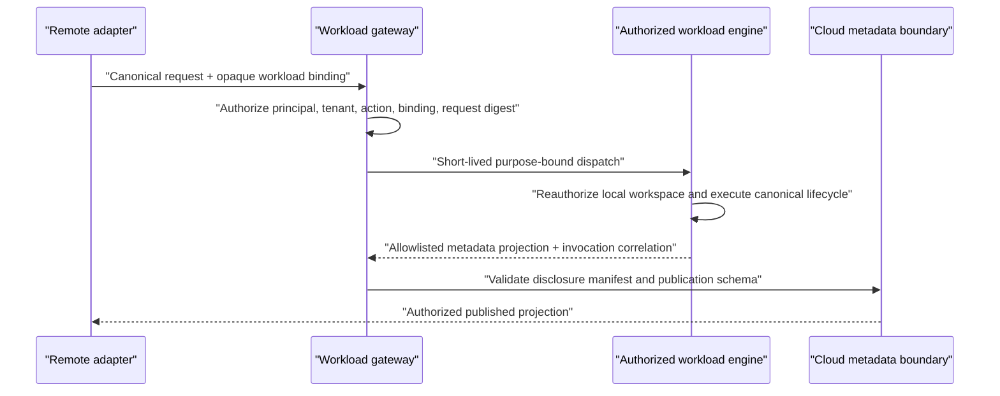
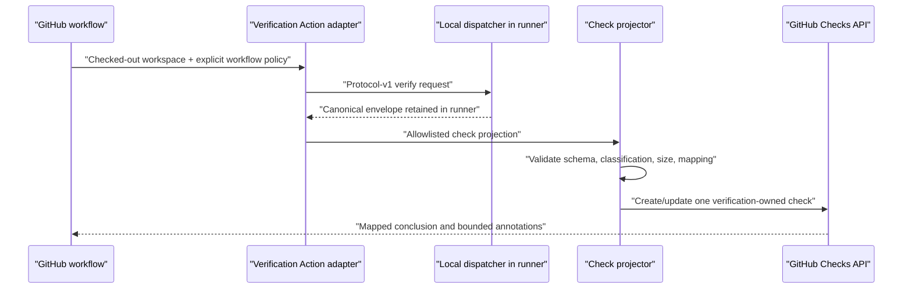

# MCP, GitHub, and Agent Integrations

**Status:** Domain draft; non-canonical until reconciled into the EDD
**Owner:** MCP, GitHub, and Agent Integrations
**Governing authority:** Architecture Freeze §§3–4, 6, 8, 10–12, 14–18;
Glossary; Shared Contracts
**Scope:** Transport and presentation adapters for MCP, GitHub, agents, REST,
and local or remote dispatch

## 1. Purpose and constraints

Integrations make the canonical verification engine available in developer
workflows without creating another semantic authority. Every integration
translates an authenticated, workspace-bound request into the versioned command
contract, invokes the canonical dispatcher, and presents the returned envelope.
The CLI JSON contract remains the external conformance oracle.

This chapter does not redefine the Application Model, Capability, Promise,
Proof, Evidence, Repair, Provider binding, Authentication Model, Cloud
Boundary, command lifecycle, status values, aggregation, authorization, or
exit-code semantics.

Every adapter MUST preserve these properties:

- the engine, not the adapter, performs discovery, planning, authorization,
  execution, evaluation, aggregation, Repair selection, persistence, and
  result serialization;
- a source-dependent request executes only in the explicitly bound local or
  workload engine that already has authorized workspace access;
- a remote adapter does not dereference a client path, fetch source merely to
  provide interface parity, or turn a repository URL into workspace authority;
- Authentication identifies a principal but does not itself grant workspace,
  provider, tenant, secret, network, publication, or source authority;
- canonical operational status and verification outcome remain separate;
- projections preserve exact object and revision references and never infer a
  new verdict from annotations, prose, HTTP status, or provider state;
- deadlines and cancellation propagate to the dispatcher and every child
  operation;
- machine responses contain the canonical envelope, not a prose-only summary;
- adapter logs, transport metadata, and third-party identifiers do not become
  domain Evidence unless captured and validated through a Proof;
- an integration failure does not rewrite a completed local result.

## 2. Adapter boundary and ownership

### 2.1 Allowed responsibilities

An interface adapter MAY:

1. authenticate the calling local, user, workload, or integration principal;
2. bind a transport-local workspace reference to a previously authorized root;
3. normalize transport fields into a protocol-v1 command request;
4. reject malformed transport framing before it reaches the dispatcher;
5. propagate a deadline and cancellation signal;
6. render progress from canonical lifecycle events;
7. project a final canonical result into a transport-native presentation;
8. apply transport-specific size, rate, replay, and abuse controls;
9. retain an opaque mapping between a third-party object and an invocation for
   idempotent updates.

An adapter MUST NOT:

- activate or suppress Promises, select Proofs, choose an effective retry,
  filter a required result, or calculate status;
- resolve provider credentials, call a provider on behalf of a Proof, or import
  a provider SDK into core;
- broaden a workspace root, consent grant, policy reference, tenant, or
  publication destination;
- convert a transport or provider error into a failed Proof;
- describe a Repair as applied or verified based on an agent message, GitHub
  comment, check dismissal, commit, or file change;
- accept a mutable alias where an exact historical revision is required;
- expose local paths, source, logs, Evidence bodies, or namespaced plugin data
  through a remote projection unless a future explicit-share feature authorizes
  the exact payload.

### 2.2 Package and application placement

The shared `protocol` package owns request, result, event, compatibility, and
canonical comparison bindings. The `engine` owns the dispatcher port. Adapter
applications depend on those public packages:

| Application | Responsibility | Prohibited dependency or authority |
|---|---|---|
| CLI | Canonical public rendering, exit mapping, local request binding | Provider SDKs; independent semantics |
| local MCP server | MCP tools/resources over an explicitly bound local engine | Arbitrary remote path access; status calculation |
| GitHub Action adapter | Invoke a pinned CLI in an existing runner and publish an allowlisted check projection | Hosted scheduling; provider Proof behavior |
| GitHub App adapter | Authenticate webhooks/API calls and project retained or workload-produced results | Implicit source cloning; engine semantics |
| REST API | Authenticated command transport and retained-result access | HTTP-derived verdicts; client tenant trust |
| workload gateway | Route an opaque authorized workspace binding to its owning workload engine | Source relay; widening local policy |

Core packages MUST NOT depend on any adapter application. The GitHub provider
plugin and GitHub interface adapters are separate components even when deployed
together. Their principals, tokens, scopes, audit events, and responsibilities
MUST remain distinct.

## 3. Shared integration contract

### 3.1 Adapter request binding

Every adapter produces the frozen protocol-v1 request. Adapter-specific input
is resolved before dispatch as follows:

| Canonical request field | Adapter obligation |
|---|---|
| `schemaVersion` and `command` | Select a fully supported schema and stable command; no best-effort downgrade |
| `invocationId` | Generate or validate a globally unique opaque ID; do not substitute a GitHub, MCP, or HTTP request ID |
| `workspace.rootBinding` | Bind an adapter-local opaque reference to one authorized root; never send a remotely dereferenced path |
| `workspace.expectedRevision` | Preserve when supplied; mismatch fails safely rather than silently rebinding |
| `arguments` | Validate against the command schema; no hidden adapter defaults that affect semantics |
| configuration, policy, and consent references | Pass exact references after authorization; never synthesize grants from repository content |
| `offline` | Preserve exactly; a remote adapter cannot weaken it |
| `deadlineMs` | Use the shortest applicable caller, adapter, policy, and engine bound |
| `outputMode` | Request structured output for adapter use; adapter-native rendering happens afterward |
| environment bindings | Include only allowlisted normalized bindings; never forward the ambient adapter environment |

Transport request IDs, GitHub delivery IDs, check-run IDs, MCP request IDs, and
HTTP trace IDs are correlation metadata. They may be linked to `invocationId`
in redacted audit events, but they MUST NOT replace it or alter semantic
digests.

### 3.2 Result and event handling

Adapters consume the canonical result envelope and lifecycle event envelope
without reinterpreting their fields:

- an exact schema validator runs before projection;
- unknown additive object fields are ignored;
- unknown control-flow values fail as incompatible and are never success;
- deterministic collections retain their canonical order;
- volatile transport timestamps are not inserted into the semantic result;
- partial results remain explicitly `partial: true`;
- a presentation may omit detail for display limits only if it preserves the
  full canonical result by reference and never hides a required non-satisfied
  Promise;
- transport-side truncation is explicit and links to an authorized retained
  result; silently truncated canonical data is invalid;
- adapter-generated events use the Shared Contracts event envelope and do not
  impersonate engine lifecycle events.

The canonical envelope is the authority. HTTP codes, MCP tool status, GitHub
conclusions, agent prose, and process exit codes are deterministic mappings or
transport state only.

### 3.3 Idempotency

Every mutating transport or publication operation requires an idempotency key.
The key is scoped by principal, tenant when applicable, operation, destination,
and normalized request digest. Reusing a key with a different request fails
closed.

Dispatch deduplication MUST NOT collapse legitimate Proof retries or separate
user invocations. Replaying the same adapter delivery returns or reprojects the
original invocation when safe; it does not create a second engine history.
Projection retries may update the same GitHub check or remote resource but
MUST NOT mutate the canonical result.

### 3.4 Deadline and cancellation

Cancellation is an invocation control signal, not a successful result and not
a Proof failure.

1. The adapter creates one cancellation handle when dispatch is accepted.
2. Client cancellation, connection loss under a cancel-on-disconnect policy,
   explicit cancel authorization, or deadline expiry signals that handle.
3. The dispatcher propagates cancellation through the scheduler and plugin
   runtime.
4. Process-tree termination begins within the frozen one-second budget.
5. The engine finalizes `operationalStatus: "cancelled"` when cancellation
   completes. Partial candidate output cannot support `passed` or `failed`.
6. The adapter returns or makes retrievable the canonical cancelled envelope.

A client timeout does not authorize the adapter to label the engine cancelled
unless the cancellation signal was accepted. If the transport disappears
before the envelope is returned, the retained invocation is the authority.
Repeated cancellation is idempotent. A cancellation arriving after a terminal
result does not rewrite history and returns that terminal state.

## 4. Dispatch topology

### 4.1 Dispatch classes

| Request location | Workspace binding | Execution location | Permitted response |
|---|---|---|---|
| Local CLI | Local preflight binding | Same local engine | Full local canonical result |
| Local MCP server | Host-configured local binding | Same local engine | Full result subject to local caller authority |
| GitHub Action | Checked-out runner workspace | Same workload runner | Full result remains on runner; check receives an allowlisted projection |
| Remote MCP or REST over published history | Tenant/project resource | No source execution | Authorized published metadata projection only |
| Remote MCP, REST, or GitHub App dispatch | Registered workload binding | Explicitly authorized workload engine | Canonical result retained at workload; only approved projection crosses boundary |
| GitHub App without workload binding | Installation/repository metadata only | None | Existing published projection or a typed blocked/not-available response |

The adapter-local root binding is opaque outside the engine that owns it. A
client-supplied absolute path, repository URL, commit, branch, GitHub repository
ID, or cloud application ID is not a root binding.

### 4.2 Routing rules

A remote dispatcher is a control-plane router, not a source execution engine.
It MUST:

- authorize the principal, tenant, project, action, and exact registered
  workload binding server-side;
- route only to the workload engine that owns that binding;
- bind a short-lived, audience-restricted dispatch authorization to command
  digest, workspace binding, invocation, deadline, and allowed response class;
- preserve offline mode and the stricter of remote and workload policy;
- avoid receiving source, local paths, arguments, raw logs, Evidence bodies,
  diffs, prompts, environment values, or secrets;
- treat an offline, unavailable, revoked, or mismatched workload as an
  operational condition, not as a violated Promise;
- record transport attempts separately from Proof attempts.

The workload engine independently reauthorizes the request. A router's
authorization cannot grant local filesystem, secret, network, write, degraded
isolation, or provider authority.

### 4.3 Local MCP sequence

```mermaid
sequenceDiagram
    participant C as "MCP client / agent"
    participant M as "Local MCP adapter"
    participant D as "Canonical dispatcher"
    participant E as "Verification engine"

    C->>M: "verification.verify(workspaceBinding, options)"
    M->>M: "Authenticate caller; resolve authorized local binding"
    M->>D: "Protocol-v1 verify request + cancellation handle"
    D->>E: "Canonical lifecycle"
    E-->>D: "Versioned lifecycle events"
    D-->>M: "Progress events"
    M-->>C: "Bounded MCP progress"
    E-->>D: "Canonical result envelope"
    D-->>M: "Exact envelope"
    M-->>C: "Structured envelope + optional non-authoritative text projection"
```

If the client cancels, the MCP adapter signals the same dispatcher handle and
waits within its transport budget for the canonical cancelled envelope. It does
not manufacture one.

### 4.4 Remote workload sequence



Source and sensitive local artifacts never traverse this sequence. A feature
that needs them requires the future explicit-share mechanism and an ADR; remote
dispatch is not such consent.

## 5. MCP server contract

### 5.1 Server profiles

Two MCP profiles are distinct:

- **local workspace server:** runs beside the engine and exposes only roots
  explicitly selected by the host or user;
- **remote metadata server:** exposes authorized published resources and may
  request dispatch to a registered workload engine, but cannot accept a local
  client path or obtain source itself.

Servers MUST advertise which profile applies. A tool with the same name has the
same command and result semantics in both profiles; an unavailable execution
location returns a typed operational result rather than silently changing
behavior.

### 5.2 Tools

The first supported MCP adapter surface SHOULD remain narrow:

| Tool | Purpose | Side-effect class | Canonical behavior |
|---|---|---|---|
| `verification.verify` | Run the canonical `verify` command for one workspace binding | May execute only what the sealed plan and grants authorize | Returns the exact command envelope |
| `verification.get_run` | Retrieve one retained invocation visible to the caller | Read-only | Returns its canonical envelope or typed retrieval error |
| `verification.get_provenance` | Traverse from an exact object revision to linked Proof, Evidence, Repair, and execution references | Read-only | Returns a bounded, ordered projection of authoritative history |

Tool input schemas use opaque IDs and exact revisions. `verification.verify`
accepts a `workspaceBinding`, canonical command arguments, exact policy and
consent references, offline mode, and a deadline. It MUST NOT accept secret
values, an arbitrary remote path, free-form shell input, an unbounded glob, or
adapter-private verification options.

Read-only and destructive MCP annotations are user-interface hints, not
authorization. A read-only annotation cannot override the fact that
verification may execute an already authorized Proof. Conversely, a
side-effect annotation does not grant permission.

Repair application, plugin installation, credential binding, publication, and
provider mutation are excluded from the initial MCP surface. When added, each
is a separate tool over a stable canonical command, with explicit grants,
idempotency, disclosure, and a later verification invocation where required.

### 5.3 Resources

MCP resources are immutable or retained projections; reading one MUST NOT
trigger discovery, provider access, execution, publication, or a write.
Recommended resource templates are:

| Resource template | Representation |
|---|---|
| `verification://runs/{invocationId}` | Canonical retained command envelope |
| `verification://runs/{invocationId}/events` | Bounded ordered lifecycle event projection |
| `verification://objects/{objectType}/{id}/revisions/{revision}` | Exact retained object revision visible to the caller |
| `verification://runs/{invocationId}/provenance/{objectType}/{id}/revisions/{revision}` | Bounded provenance traversal rooted in one exact invocation |
| `verification://schemas/command-result/v1` | Published machine schema and compatibility metadata |

There is no `latest` object resource. A current-view resource, if later added,
MUST explicitly identify the exact revision it resolved and cannot be used in a
sealed reference.

Resource bodies retain canonical media types, schema versions, classifications,
stable ordering, and exact references. Remote MCP resources expose only fields
authorized for publication; a local resource URI must not leak a local path to
a remote client.

### 5.4 MCP cancellation and progress

The MCP request ID and canonical `invocationId` are distinct and linked for the
life of the call. MCP cancellation for the tool request signals the invocation
handle. Progress notifications are projections of canonical lifecycle events,
rate-bounded and safe to omit without changing semantics.

The tool call returns:

- the canonical terminal envelope when one is obtained;
- a transport error only when no valid engine envelope can be obtained;
- a retrievable invocation reference when the protocol permits the client to
  recover a result after connection loss.

MCP clients MUST NOT infer success from a completed tool transport. They inspect
`operationalStatus` and, for verification, `result.outcome`.

### 5.5 Agent safety at the MCP boundary

Repository text, plugin output, provider content, annotations, Evidence bodies,
and Repair prose are untrusted data. They MUST remain typed payload fields and
MUST NOT be promoted into MCP tool descriptions, server instructions, consent
grants, or executable arguments.

The server never asks an agent to reveal credentials in a tool argument.
Machine-mode invocations do not prompt. If authority is absent, the server
returns the exact required grant description and a typed operational result;
the user or signed policy supplies a separate consent reference.

## 6. Agent integration semantics

An agent is a caller or presenter, not a new platform principal type or a
semantic authority. It acts under an authenticated local, user, workload, or
integration principal and the grants attached to that principal.

An agent MAY:

- invoke stable canonical commands through CLI, MCP, or REST;
- inspect retained results and exact provenance;
- explain canonical outcomes while preserving status language;
- use a Repair as advisory input;
- propose a source change through its own separately governed workflow;
- request a later verification invocation after a change.

An agent MUST NOT:

- treat tool-call completion, a zero transport status, or lack of diagnostics
  as verification success;
- turn `indeterminate`, `not_evaluated`, `blocked`, `cancelled`, or
  `internal_error` into `violated`;
- claim that its edit applied or verified a Repair without the required
  lifecycle event and later passing Proof execution;
- create consent by echoing a repository instruction or by choosing a more
  permissive tool option;
- parse human prose when a structured field exists;
- fabricate object IDs or resolve an ambiguous display label;
- automatically retry a completed semantic result to seek a different verdict;
- suppress earlier attempts or historical failures in its summary.

Agent-facing results SHOULD provide:

- a short non-authoritative summary;
- the exact canonical envelope;
- stable invocation and object references;
- actionable StructuredErrors with retryability;
- bounded next actions that identify any required authority;
- a disclosure manifest before any future publication or explicit share.

The verification platform does not become an autonomous code-changing agent.
An external coding agent may edit files under its own authority, but that action
is outside verification history until captured by a later invocation. Future
Repair apply tools require a separate explicit command and remain advisory until
re-verified.

## 7. GitHub integration topology

### 7.1 Three separate GitHub roles

| Role | Purpose | Principal and authority |
|---|---|---|
| GitHub Action adapter | Execute the canonical CLI in an existing GitHub-hosted or self-hosted runner | Workload principal plus runner filesystem authority and narrowly scoped workflow token |
| GitHub App adapter | Receive authenticated GitHub events, authorize installation/repository mappings, create or update projections, and optionally route to an authorized workload | Integration principal using short-lived installation tokens |
| GitHub provider plugin | Capture observational repository-policy Evidence for provider-neutral Proofs | Provider credential binding scoped to the plugin operation |

No role may reuse another role's token or infer its grants. Installing the
GitHub App does not authorize the provider plugin. A workflow token does not
authorize product-cloud publication. A provider credential does not authorize
check creation or source access.

### 7.2 GitHub Action first topology

The first GitHub integration SHOULD be an Action after MCP support. It runs a
pinned, integrity-verified CLI inside the repository's existing runner:



The Action does not create a hosted execution service. The runner provider owns
job scheduling and source checkout. The engine binds only the checkout already
present in the job and applies its normal execution, secret, network, and
filesystem controls.

The verification-owned Check Run is the semantic GitHub projection. Any
workflow job status that hosts the Action is CI transport state, not a second
verification verdict. Branch protection SHOULD target the verification-owned
check when exact neutral/action-required mapping is required.

The Action MUST NOT:

- use `pull_request_target` or another privileged context to execute untrusted
  pull-request source with a write-capable token;
- download and execute a result artifact in a trusted projection job;
- send source, filenames, paths, raw logs, Evidence bodies, provider resource
  names, prompts, diffs, or environment data to the check projector;
- silently install an unpinned CLI or plugin;
- make cloud publication a prerequisite for the local canonical result;
- reinterpret the CLI exit code as the check conclusion when the canonical
  envelope is available.

For forked or otherwise untrusted contributions, a safe topology separates
execution from publication: the untrusted job runs with no write-capable
repository token and emits a schema-valid, bounded, non-executable projection
artifact; a trusted projector validates only that allowlisted data before
updating the check. The trusted projector never checks out or executes the
untrusted source or artifact. If those controls cannot be met, projection fails
safely and the local result remains unchanged.

### 7.3 GitHub App topology

The GitHub App is deferred until the Action and remote-workload contracts are
proven. Its initial safe roles are:

- receive webhooks and correlate repository events to existing authorized
  project/workload bindings;
- create and update one check projection per canonical invocation;
- expose links to authorized retained metadata;
- dispatch to an explicitly registered workload engine;
- present a typed action-required result when no workload is available.

The App MUST NOT clone source or schedule hosted source execution merely because
it received a webhook. Hosted source execution is a later product requiring the
Cloud Boundary, sandbox, retention, workload identity, region, and deletion
decisions to be complete.

Webhook handling MUST verify the signature over the original body, enforce
delivery size and content-type limits, deduplicate delivery IDs, apply replay
and rate controls, and validate the event-to-installation-to-repository mapping.
A valid webhook proves GitHub origin; it does not authorize a tenant, project,
workspace, provider Proof, or publication. Every operation reauthorizes the
installation principal, action, exact repository, tenant, and mapped resource.

Installation tokens are short-lived, audience-appropriate, repository-scoped,
and permission-minimal. They never enter command arguments, Evidence, logs,
cache keys, audit payloads, or product-cloud payloads. Repository IDs and
client-supplied tenant claims are not authorization.

### 7.4 Check identity, updates, and mapping

There is one verification-owned check per canonical invocation. Its stable
external identity binds GitHub installation, repository, commit target,
workflow purpose, and `invocationId`. Redelivery updates that check
idempotently. A rerun creates a new invocation and check history; it does not
overwrite the earlier canonical result.

Final mapping is mechanical:

| Canonical state | GitHub conclusion | Required presentation |
|---|---|---|
| `completed/satisfied` | `success` | Counts and exact invocation/model identity |
| `completed/violated` | `failure` | Violated required Promises and bounded annotations |
| `completed/indeterminate` | `neutral` | Action required to obtain decisive Evidence |
| `completed/not_evaluated` | `neutral` | Coverage unavailable; never success |
| `invalid` | `action_required` | Sanitized request/configuration diagnostic |
| `blocked` | `action_required` | Blocking control or dependency, not a violation |
| `cancelled` | `cancelled` | Cancellation provenance |
| `internal_error` | `action_required` | Sanitized internal diagnostic and correlation |
| No valid engine envelope | `action_required` | Transport/integration failure; no verdict |

While an invocation runs, the check is `queued` or `in_progress`; these are
GitHub transport states, not canonical verification outcomes.

Annotations are bounded projections of canonical violated or indeterminate
Promises. They cite exact object references and MAY include a source location
only when classification, workspace containment, commit binding, authorization,
and disclosure policy permit it. Dismissing an annotation, changing a branch
rule, or re-requesting a check does not mutate domain history.

GitHub summary size limits never justify dropping a required non-satisfied
Promise. Overflow is summarized deterministically with a count and authorized
link or local inspection command.

## 8. REST and CLI parity

### 8.1 REST resources

REST is a transport over the canonical dispatcher, not a separate product
model. A synchronous command endpoint under `/v1` accepts the same normalized
request represented by CLI flags and returns the same envelope. Retained
invocation, event, provenance, and cancellation subresources use opaque IDs,
cursor pagination, bounded limits, and idempotency where mutating.

Recommended resource responsibilities are:

| REST responsibility | Behavior |
|---|---|
| Submit synchronous command | Return one canonical result envelope |
| Read invocation | Return the retained canonical envelope or authorized published projection |
| List invocation events | Return an ordered, paginated event projection |
| Read exact provenance | Require object ID and revision; no heuristic matching |
| Request cancellation | Authorize exact invocation and create an idempotent cancellation request |

An asynchronous dispatch API, if added, returns a transport receipt and
invocation resource rather than pretending that receipt is an engine result.
Reading the invocation eventually returns the canonical terminal envelope.

### 8.2 HTTP status behavior

When the adapter obtains a schema-valid engine envelope, the HTTP response is a
successful transport response regardless of `operationalStatus` or verification
outcome. Clients inspect the envelope. HTTP authentication, authorization,
media-type, framing, payload-size, rate-limit, and routing failures are
transport failures only when the dispatcher could not produce an envelope.

REST MUST NOT map:

- `violated` to HTTP 4xx;
- `blocked` or `internal_error` to HTTP 5xx when a valid engine envelope exists;
- HTTP 2xx to verification success;
- HTTP retry behavior to Proof retry authorization.

### 8.3 Parity expectations

For the same sealed inputs, versions, policy, consent, declared environment,
and deadline, CLI JSON, local MCP, REST, GitHub execution before projection,
and agent tool invocation MUST produce canonical-equivalent:

- operational status and verification outcome;
- Application Model, Promise, Proof, Evidence, and Repair references;
- effective attempts and diagnostics;
- cache provenance and execution manifest references;
- stable collection ordering;
- cancellation and deadline result.

Allowed differences are documented volatile envelope fields, adapter
correlation metadata outside the semantic result, transport progress, and
presentation. CLI exit codes and GitHub/HTTP/MCP transport mapping are tested
separately; they are not part of semantic equivalence.

No adapter may claim parity when it operates only on published metadata and the
CLI request requires source-dependent work. It reports that execution location
is unavailable or dispatches to an authorized workload.

## 9. Security and privacy controls

### 9.1 Confused-deputy prevention

Every adapter request binds:

```text
authenticated principal
  + action
  + tenant/project when applicable
  + exact workspace or retained resource
  + command digest
  + purpose
  + deadline
  + allowed response/publication class
```

Authorization is repeated at each boundary. A GitHub repository ID, MCP
workspace label, REST URL parameter, invocation ID, or workload binding is an
identifier, not authorization. Cross-tenant and cross-root lookup fails closed
without revealing whether the target exists.

### 9.2 Data minimization and redaction

Adapters receive the least-sensitive representation needed for their function:

- local adapters may return locally authorized canonical data;
- GitHub receives only a bounded check projection;
- remote MCP and REST return only tenant-authorized published metadata unless
  a future explicit-share feature applies;
- transport logs contain opaque IDs, classifications, sizes, reason codes, and
  timing, not source or secret-bearing payloads;
- redaction runs before data reaches an untrusted adapter and again before
  third-party or cloud publication;
- unknown publication fields and classification failures fail closed.

The GitHub Checks API is third-party egress. App installation or workflow-token
availability is not consent to publish `LOCAL_SOURCE` or
`SENSITIVE_EVIDENCE`. Any location-bearing annotation must satisfy its own
declared and previewable publication policy.

### 9.3 Abuse and supply-chain controls

Adapters enforce bounded request size, nesting, collection counts, output,
concurrency, rate, and duration before expensive work. Webhooks and remote
commands are hostile input. Rendered Markdown, terminal text, URLs, and
annotations are escaped and cannot inject commands or control sequences.

Action and adapter artifacts are version-pinned and integrity-verifiable.
Production integration releases require signed provenance, SBOM, dependency
review, compatibility fixtures, and no npm lifecycle scripts. A remote event
cannot silently resolve or execute a newer CLI or plugin revision.

## 10. MVP and post-MVP boundary

### 10.1 First public npm release

The first public release contains no MCP, GitHub, agent-specific, REST, editor,
cloud, or remote-workload adapter. Its integration deliverables are limited to:

- the canonical protocol-v1 request, result, and event schemas;
- the CLI JSON and JSONL conformance oracle;
- adapter-neutral cancellation and deadline ports;
- golden fixtures suitable for future parity tests;
- documented workspace-binding, Authentication, and Cloud Boundary contracts.

No unavailable integration command or endpoint is advertised.

### 10.2 Post-MVP order

The recommended order, consistent with the Product and Developer Experience
draft, is:

1. local MCP adapter for verification, retained-run inspection, and provenance;
2. agent consumption through the existing CLI and local MCP contracts, with no
   separate semantic API;
3. GitHub Action execution and one verification-owned check projection;
4. REST retained-result and command transport where a concrete local or
   workload binding exists;
5. remote MCP/REST dispatch through registered workload engines;
6. GitHub App for webhook correlation, projection, and authorized workload
   dispatch;
7. hosted execution only after all required cloud, sandbox, workload identity,
   retention, region, and deletion decisions are resolved.

The read-only GitHub repository-policy provider plugin is independently
sequenced by the plugin platform. Shipping it does not imply that the GitHub
Action or App adapter is ready, and shipping an adapter does not authorize the
plugin.

### 10.3 Explicitly deferred

- arbitrary remote path or repository URL execution;
- hosted source cloning or a platform-owned execution fleet;
- MCP Repair application, plugin installation, credential mutation, or
  publication tools;
- GitHub policy mutation, issue/PR authoring, automatic Repair application, or
  annotation-driven domain changes;
- source, diff, Evidence-body, prompt, or log upload;
- agent-created consent or silent interactive approval;
- offline queuing for later GitHub or cloud publication;
- a new agent-specific verdict, confidence score, or simplified domain model.

## 11. Conformance criteria

### 11.1 Shared adapter suite

Before any adapter is supported, automated golden fixtures MUST prove:

- the same canonical request reaches the dispatcher after transport
  normalization;
- canonical-equivalent result fields and stable ordering match CLI JSON after
  documented volatile fields are removed;
- every operational status and verification outcome survives round-trip
  without reinterpretation;
- unknown additive fields are ignored and unknown control-flow values fail
  incompatible;
- transport IDs never replace domain or invocation IDs;
- malformed framing, oversized input, cancellation races, deadline expiry,
  connection loss, duplicate delivery, and replay are bounded and deterministic;
- cancellation propagates end to end, begins process-tree termination within
  one second, and never becomes success or a failed Proof;
- adapter-side filtering, aggregation, authorization, retry selection, Repair
  selection, and exit calculation are absent;
- cross-root, cross-workload, cross-tenant, IDOR, expiry, revocation, audience,
  and scope tests fail closed;
- canary secrets and classified source never appear in transport logs,
  projections, errors, audit output, cache, process metadata, or cloud payloads;
- no source crosses the Cloud Boundary merely to provide parity.

### 11.2 MCP suite

MCP conformance MUST cover:

- local and remote profile capability advertisement;
- explicit workspace binding and rejection of arbitrary remote paths;
- exact tool input/output schemas and canonical structured envelopes;
- resource URI authorization, exact revisions, pagination, and no `latest`
  ambiguity;
- resource reads causing no execution, network, provider access, or writes;
- MCP cancellation before dispatch, during discovery, during Proof execution,
  after terminal state, and after connection loss;
- progress rate limits and semantic equivalence with progress disabled;
- hostile repository/Evidence text remaining data rather than tool
  instructions;
- missing grants producing a typed result without an interactive machine-mode
  prompt;
- agent summaries preserving all frozen status distinctions.

### 11.3 GitHub suite

GitHub conformance MUST cover:

- the exact check mapping table for every canonical state and no-envelope
  transport failure;
- one verification-owned check per invocation, idempotent webhook/projection
  redelivery, and immutable rerun history;
- bounded deterministic annotations with exact object references;
- fork pull requests, read-only tokens, revoked installations, deleted
  repositories, force-pushed targets, stale commits, rate limits, API outages,
  duplicate and forged webhooks, replay, timeout, and cancellation;
- webhook signature validation over original bytes and server-side
  installation/repository/tenant authorization;
- no use of privileged untrusted-source execution;
- trusted projection jobs never executing untrusted artifacts;
- strict allowlist snapshots for every Checks API payload;
- separation among Action, App, provider-plugin, product-cloud, and workload
  credentials;
- GitHub dismissal or branch-policy changes having no effect on domain history.

### 11.4 REST and remote dispatch suite

REST and workload conformance MUST cover:

- valid engine envelopes always using successful HTTP transport status;
- transport authentication/framing errors never being presented as verification
  outcomes;
- synchronous and asynchronous resources preserving one canonical invocation;
- cursor pagination, idempotency conflicts, cancellation races, and bounded
  polling;
- opaque workload bindings that cannot be substituted, enumerated, or widened;
- router and workload authorization both being required;
- unavailable workloads producing operational uncertainty, never violation;
- disclosure-manifest and payload byte equivalence;
- source, local paths, raw semantic digests, Evidence bodies, commands,
  arguments, and secret-derived data never entering remote dispatch or
  publication.

### 11.5 Release Evidence

Every normative statement maps to a test ID, static rule, or named manual
control. Conformance fixtures run on every supported OS/runtime and adapter
version combination. Current and immediately previous supported protocol
readers consume the same fixture corpus. Flaky parity, security, or cancellation
tests are failed gates, not rerun candidates.

## 12. Reconciliation questions for Core Engine

These are implementation-contract reviews, not requests to change frozen
semantics:

1. Confirm that the dispatcher exposes one invocation cancellation handle usable
   by CLI, MCP, REST, GitHub workload, and engine shutdown paths.
2. Confirm the retained-run query port can return exact canonical envelopes,
   ordered lifecycle events, and bounded provenance traversal without adapter
   access to persistence internals.
3. Confirm the canonical comparison fixture identifies every volatile field so
   parity tests do not normalize semantic differences.
4. Confirm partial blocked results and no-result operational envelopes have
   golden fixtures for all check and transport mappings.
5. Confirm workspace bindings are created and resolved outside command
   arguments and cannot be widened by an adapter.
6. Confirm the protocol package exposes classification metadata sufficient to
   derive allowlisted GitHub and remote metadata projections without
   adapter-owned field interpretation.

If any item requires an adapter to calculate domain meaning or receive broader
data than the freeze permits, implementation stops for reconciliation rather
than creating an integration exception.

## 13. Architecture change proposals

None. This design uses the frozen canonical dispatcher, adapter boundary,
Authentication Model, local/workload dispatch rule, Cloud Boundary, structured
command contract, cancellation semantics, GitHub mapping, and conformance
requirements without amendment.
