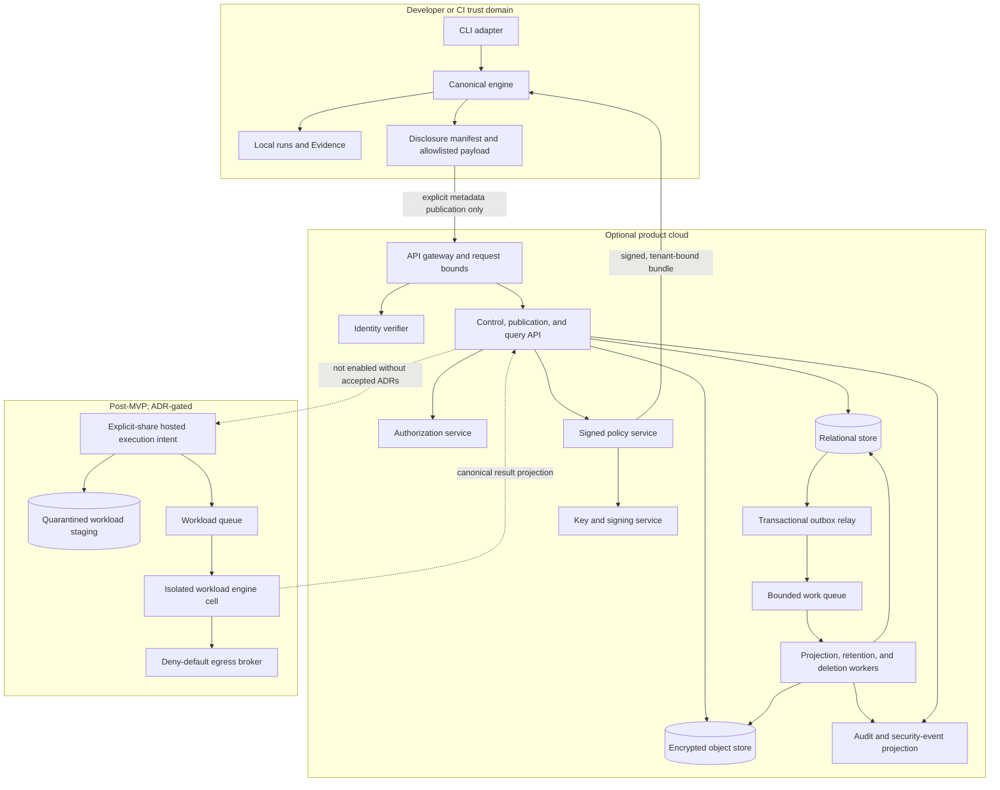
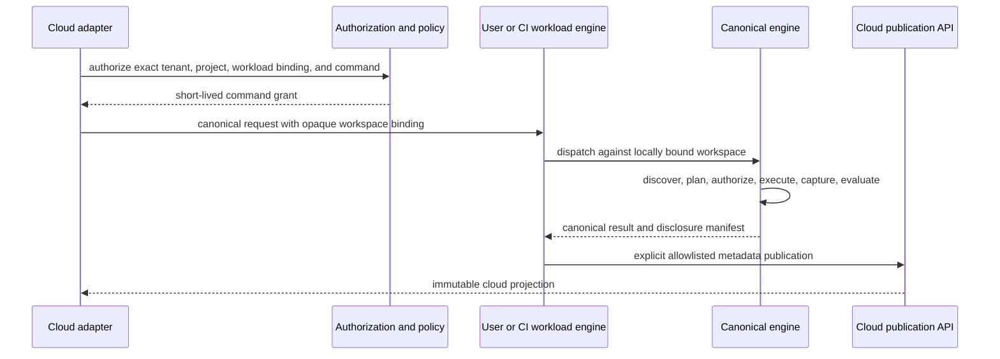

# Cloud and Data Platform

**Status:** Domain draft for EDD reconciliation
**Owner:** Cloud and Data Platform
**Governing authority:** Architecture Freeze §§2–4, 5.2, 5.7, 5.10, 6,
10–12, 14–18, 20; Glossary; Shared Contracts
**Scope:** Product-cloud control plane, metadata publication, durable cloud
projections, persistence, REST resources, asynchronous work, deletion, and the
future workload-engine boundary

## 1. Purpose and constraints

The product cloud is an optional collaboration and control plane around the
local semantic engine. It provides durable team history, signed organization
policy distribution, explicit metadata publication, and later attestations. It
does not become a second verification engine.

The cloud stores and serves projections of canonical results. It MUST NOT:

- be required for discovery, local Proof execution, local Evidence storage,
  structured output, cache access, or retained local-run inspection;
- calculate a Promise, Proof, Repair, or aggregate verification status;
- accept a local path as a remotely dereferenceable workspace;
- receive `SECRET` under any feature;
- receive `LOCAL_SOURCE`, `SENSITIVE_EVIDENCE`, raw local semantic revisions,
  or raw local content digests through default metadata publication;
- infer publication consent from login, tenant membership, policy enrollment,
  provider credentials, or prior publication;
- queue a failed or offline publication locally for later transmission in
  Phase 1;
- let a REST resource, database row, dashboard, worker, or event become an
  independent mutable source of domain truth.

The local engine remains the authority that constructs the disclosure manifest,
classifies and redacts fields, derives tenant-scoped publication identifiers,
and serializes the allowlisted payload. The cloud independently authenticates,
authorizes, validates, limits, stores, and audits that hostile payload.

## 2. Release boundaries

### 2.1 First public CLI release

The MVP has no cloud runtime dependency and ships no cloud login, publication,
database, queue, hosted worker, team history, policy distribution, billing, or
REST surface. Cloud schemas MAY exist as unpublished contract fixtures so the
local result model is not later distorted, but the CLI MUST NOT advertise an
unavailable cloud operation.

No cloud service is on the critical path for the MVP. A fully unavailable cloud
therefore has no effect on MVP verification.

### 2.2 First cloud milestone

The first cloud milestone is metadata-only and contains:

1. user and workload authentication;
2. tenant, membership, project, and application-alias control-plane resources;
3. publication-intent negotiation and explicit disclosure preview;
4. ingestion of only the Architecture Freeze §11.3 allowlist;
5. immutable run and result projections;
6. signed organization-policy distribution;
7. auditable retention and deletion;
8. a read API and simple team-history projection.

It does not accept repository archives, file names, paths, commit or branch
identifiers, provider resource names, Evidence bodies, logs, commands,
arguments, prompts, namespaced plugin payloads, or secret-derived unkeyed
hashes.

### 2.3 Later cloud milestones

Attestations, enterprise identity, regional residency, legal hold, longer-lived
audit tiers, organization policy administration, and usage metering are
post-MVP. Exact commercial packaging is a founder decision and does not change
the data boundary.

Any feature that sends `LOCAL_SOURCE` or `SENSITIVE_EVIDENCE`, including a
vendor-operated hosted source execution service, requires an accepted ADR that
amends or specializes Architecture Freeze §11.2. A vendor-operated execution
fleet also conflicts with the broad prohibition in Freeze §2.2 and therefore
cannot be introduced as an implementation detail.

Until those ADRs are accepted, remote source-dependent work dispatches to an
explicitly authorized workload engine in the user's CI, infrastructure, or
local environment. The cloud may coordinate and retain its allowlisted result
projection, but it does not receive the source.

## 3. Logical cloud architecture

The cloud has four logical planes. A deployer may colocate components initially,
but the trust and dependency boundaries remain explicit.

| Plane | Responsibilities | Prohibited responsibilities |
|---|---|---|
| Edge and identity | TLS termination, request bounds, token validation, abuse controls, request correlation | Domain authorization based only on a token claim; result semantics |
| Control API | Server-side authorization, tenancy, project/application aliases, publication intents, policy delivery, deletion requests | Source fetch, provider credential use, Promise/Proof evaluation |
| Ingestion and query | Strict payload validation, idempotent persistence, immutable projections, cursor queries | Schema guessing, field passthrough, verdict calculation |
| Async data work | Projection rebuild, retention purge, deletion, backup verification, attestation preparation | Accepting unbounded inline payloads or weakening authorization |

The logical components are:

- **API gateway:** enforces authenticated transport, supported content types,
  decompressed-size limits, request deadlines, and request IDs.
- **Identity verifier:** validates short-lived audience-restricted access
  tokens and resolves a server-side principal.
- **Authorization service:** evaluates principal, action, tenant, exact
  resource, policy revision, and any sensitive-operation requirement.
- **Publication service:** creates purpose- and retention-bound intents and
  accepts an exact manifest/payload pair.
- **Policy service:** stores versioned policy bundles and returns signed,
  tenant-bound distributions with issue and expiry intervals.
- **History query service:** returns authorized projections of already
  published metadata.
- **Relational store:** owns resource identity, authorization relationships,
  immutable projection indexes, idempotency, job state, audit indexes, outbox,
  retention, and deletion control records.
- **Object store:** retains canonical received envelopes and future
  explicitly-shared blobs under immutable, tenant-prefixed keys.
- **Queue and workers:** perform bounded retry-safe data-plane tasks from
  references, never from hidden ambient tenant or secret context.
- **Key service:** supplies encryption and signing operations without exposing
  key material to normal application logs or payloads.

Cloud adapters may invoke the canonical dispatcher only for operations over
already-published cloud metadata or for an explicitly bound workload engine.
They MUST return or project the dispatcher result without independent filtering
or status calculation.

## 4. Deployment architecture



Object storage, queue, and key-service products remain vendor-neutral. D-002
selects the vendor, initial region, and managed products before hosted
implementation. That selection must satisfy this logical design and does not by
itself authorize a new data class.

## 5. Local-to-cloud publication protocol

Publication is a separate explicit command. It does not silently follow
`verify`, login, policy fetch, or provider access.

### 5.1 Publication preparation

The local engine:

1. selects one complete retained canonical result or an explicitly permitted
   partial result;
2. selects a named publication-purpose schema;
3. converts local IDs and revisions to locally keyed, tenant-scoped,
   object-type-domain-separated publication identifiers;
4. builds an allowlisted payload using only Freeze §11.3 fields;
5. classifies every field and calculates exact encoded byte counts;
6. builds a disclosure manifest containing destination tenant/project,
   purpose, schema version, retention policy reference, fields,
   classifications, sizes, and payload digest;
7. displays the manifest or makes the identical machine-readable manifest
   inspectable;
8. obtains an explicit user, workload, or signed-policy authorization for that
   exact manifest;
9. requests a cloud publication intent; and
10. reserializes and revalidates the payload immediately before send.

The disclosure manifest digest binds exact canonical payload bytes, destination,
purpose, schema major, retention-policy revision, and expiry. Any drift requires
a new preview and authorization.

### 5.2 Publication intent

A publication intent is short-lived, single-purpose, single-tenant,
single-project authorization metadata. It contains:

| Field | Meaning |
|---|---|
| intent ID | Opaque cloud ID |
| principal ID | Server-resolved actor |
| tenant and project IDs | Exact authorized destination |
| purpose | Stable publication-purpose identifier |
| payload schema | Exact supported schema major/minor |
| disclosure-manifest digest | Exact local preview binding |
| maximum encoded and decompressed bytes | Server-enforced limits |
| retention-policy ID and revision | Policy selected before upload |
| nonce and expiry | Replay boundary |
| issued-at policy revision | Authorization context |

An intent contains no repository or Evidence content. The server rejects reuse,
expiry, tenant mismatch, purpose mismatch, manifest mismatch, policy
revocation, or an unsupported retention class.

### 5.3 Upload and acceptance

The publication request includes the intent, disclosure manifest, exact payload,
an idempotency key, and the local audit correlation ID. The server:

1. validates token audience, expiry, principal, action, tenant, project, and
   intent;
2. enforces content type, encoded/decompressed size, nesting, string, array,
   count, and numeric bounds before materialization;
3. validates the manifest and payload independently against closed allowlist
   schemas;
4. proves the serialized payload fields, classifications, and byte counts match
   the approved disclosure manifest;
5. rejects unknown fields, duplicate keys, ambiguous encodings, invalid Unicode,
   unsupported control-flow values, and forbidden classifications;
6. reserves the idempotency tuple;
7. durably records the canonical envelope, immutable projection, audit event,
   and outbox event; and
8. returns a cloud publication resource.

The idempotency tuple is tenant, project, principal class, operation, and
idempotency key. Repeating an accepted request with the same canonical request
digest returns the existing resource. Reusing the key with different bytes,
destination, purpose, or retention returns a structured conflict and creates
no second publication.

Acceptance means the cloud durably stored the publication. It does not increase
the trust, reproducibility class, Evidence validation state, or verification
authority of the local result.

### 5.4 Failure behavior

No local result changes because publication fails. If publication is the
primary command, its canonical result reports the publication failure; it does
not rewrite the earlier verification outcome.

Timeout before a server response is resolved by an idempotency lookup. The
client never sends a second semantic request under a new key merely to seek
success. Phase 1 keeps no offline transmission queue and performs no hidden
retry after the command exits.

## 6. REST and OpenAPI surface

The cloud publishes OpenAPI 3.1 documents generated from or validated against
the same machine schemas used by the service. JSON Schema majors, event
schemas, command protocol, and REST API versions remain independently
identifiable.

### 6.1 Conventions

- Paths are plural nouns under `/v1`.
- IDs are opaque and never encode tenant, provider, path, or business meaning.
- Tenant is an exact path-scoped resource resolved server-side; a client tenant
  header or token claim is not sufficient authorization.
- List endpoints use opaque cursor pagination, a bounded `limit`, and stable
  `(createdAt, id)` ordering unless the resource defines another stable order.
- Writes require `Idempotency-Key`; the service returns the key status and
  request digest reference.
- Reads of immutable resources support strong entity tags. Conditional writes
  are used only for mutable control-plane aliases and policies, never for
  immutable domain history.
- Timestamps are RFC 3339 UTC metadata; durations are integer milliseconds.
- API errors use `StructuredError` with a stable `VFY_<DOMAIN>_<CONDITION>`
  code. Provider names never enter error codes.
- Authentication and authorization failures do not reveal whether a
  cross-tenant resource exists.
- Valid canonical command envelopes use successful HTTP transport status;
  transport errors mean no engine envelope was obtained.
- Unknown additive response fields are ignored. Unknown control-flow values
  fail safely as incompatible.

### 6.2 Initial control and metadata resources

| Method and path | Purpose | Notes |
|---|---|---|
| `GET /v1/tenants` | List authorized tenant projections | Never an unrestricted directory |
| `GET /v1/tenants/{tenantId}` | Read an authorized tenant | Membership is separately authorized |
| `GET/POST /v1/tenants/{tenantId}/projects` | List or create project resources | Creation is idempotent |
| `GET/PATCH /v1/tenants/{tenantId}/projects/{projectId}` | Read or change mutable project metadata | Exact action authorization and entity tag |
| `GET/POST /v1/tenants/{tenantId}/projects/{projectId}/applications` | Manage non-sensitive cloud aliases | Alias is user supplied, not inferred from source |
| `POST /v1/tenants/{tenantId}/projects/{projectId}/publication-intents` | Bind manifest, purpose, limits, and retention | No content upload |
| `POST /v1/tenants/{tenantId}/projects/{projectId}/publications` | Accept one manifest/payload pair | Strict closed ingestion schema |
| `GET /v1/tenants/{tenantId}/projects/{projectId}/publications/{publicationId}` | Read immutable acceptance metadata | Includes validation and retention state |
| `GET /v1/tenants/{tenantId}/projects/{projectId}/runs` | List authorized run projections | Cursor paginated |
| `GET /v1/tenants/{tenantId}/projects/{projectId}/runs/{runId}` | Read one canonical result projection | Does not recalculate outcome |
| `GET /v1/tenants/{tenantId}/projects/{projectId}/runs/{runId}/promise-results` | List immutable Promise projections | Exact publication identifiers only |
| `GET /v1/tenants/{tenantId}/projects/{projectId}/runs/{runId}/proof-executions` | List immutable Proof projections | Exact effective-attempt marker retained |
| `GET /v1/tenants/{tenantId}/projects/{projectId}/runs/{runId}/evidence-descriptors` | List metadata-only Evidence descriptors | No body in first cloud milestone |
| `GET /v1/tenants/{tenantId}/policies/{policyId}/revisions/{revisionId}` | Fetch a signed policy bundle | Tenant-bound issue/expiry interval |
| `POST /v1/tenants/{tenantId}/deletion-requests` | Request authorized erasure | Target, reason class, scope, and authority |
| `GET /v1/tenants/{tenantId}/deletion-requests/{deletionRequestId}` | Inspect progress and backup-expiry deadline | Does not expose deleted content |
| `POST /v1/commands` | Dispatch a canonical command over already-published data | Source-dependent commands require a bound workload engine |

Mutation-like actions are explicit subresources. Cancellation, if introduced,
uses a cancellation resource rather than a mutable status field. Attestations
and hosted workload resources are not present in the initial OpenAPI document.
They are added only in the milestone that implements them.

### 6.3 Response projection rules

REST representations preserve exact cloud publication identifiers and their
local object-type domains. They do not expose or reconstruct raw local semantic
revisions. A run projection includes:

- source publication ID and payload schema;
- canonical operational status and verification outcome received from the
  engine;
- Application Model, Promise, Proof, and Evidence publication identifiers;
- every attempt and the explicit effective attempt;
- stable reason codes, classifications, aggregate counts, and durations;
- engine, protocol, plugin, and public artifact identity;
- retention, deletion, and audit references.

A server-side view may add cloud envelope metadata, authorization-filtered
links, or presentation summaries. It may not omit a required non-satisfied
Promise from the machine resource or derive a new verdict.

## 7. Logical relational schema

The reference logical database is PostgreSQL-style: transactional relational
storage, composite tenant-scoped constraints, row-level security as defense in
depth, an append-only event/outbox path, and online schema migration support.
This is a logical requirement, not a frozen vendor selection.

### 7.1 Identity and control tables

| Table | Key and important fields | Rules |
|---|---|---|
| `tenants` | `tenant_id`, status, created metadata | Root cloud scope; opaque ID |
| `principals` | `principal_id`, principal type, issuer, immutable external subject digest | No provider credential material |
| `tenant_memberships` | `(tenant_id, principal_id)`, role-bundle reference, state, revision | Expanded actions evaluated server-side |
| `projects` | `(tenant_id, project_id)`, alias, state, policy reference | Alias is non-sensitive and mutable with revision control |
| `applications` | `(tenant_id, application_id)`, project ID, user alias, state | Cloud alias, not the Application Model authority |
| `authorization_policies` | `(tenant_id, policy_id, revision_id)`, signed bundle reference, issue/expiry | Revisions immutable |
| `retention_policies` | `(tenant_id, retention_policy_id, revision_id)`, class, active duration, backup expiry, legal-hold eligibility | Revision selected before publication |

Every tenant-owned primary and foreign key includes `tenant_id`, including
references within the same service. There is no globally unique lookup path
that omits tenant authorization merely because IDs are statistically unique.

### 7.2 Publication and projection tables

| Table | Key and important fields | Rules |
|---|---|---|
| `publication_intents` | `(tenant_id, intent_id)`, project, principal, purpose, manifest digest, bounds, policy revision, nonce, expiry, consumed state | Short-lived; no payload |
| `idempotency_records` | tenant/project/principal class/operation/key, canonical request digest, response resource, expiry | Same key plus different digest is conflict |
| `publications` | `(tenant_id, publication_id)`, project, intent, purpose, schema, manifest digest, cloud payload digest, object reference, accepted time, retention deadline | Immutable acceptance record |
| `run_projections` | `(tenant_id, run_id)`, project, application alias reference, local run publication ID, operational status, outcome, engine identity, counts, durations | Immutable projection; no raw local revision |
| `promise_result_projections` | tenant/run/promise publication ID, criticality, status, stable reason codes, stable order | Composite tenant/run foreign key |
| `proof_execution_projections` | tenant/run/proof publication ID/attempt publication ID, terminal result, effective flag, reproducibility class, duration | All attempts retained |
| `evidence_descriptors` | tenant/run/Evidence publication ID, type, media type, byte size, sensitivity class, validation state | No Evidence body in first cloud milestone |
| `publication_edges` | tenant, from object type/ID, relation, to object type/ID, stable order | Supports provenance traversal and deletion tombstones |

The database never treats `outcome`, Proof result, or Evidence validation as a
database-generated inference. These are schema-validated projections of the
canonical engine result. Constraints enforce allowed values and referential
integrity, but do not decide them.

The canonical accepted payload is retained separately from normalized query
projections so a projection can be rebuilt without inventing facts. Projection
rows include payload schema, projector version, and source publication ID.

### 7.3 Operations, audit, and asynchronous work

| Table | Key and important fields | Rules |
|---|---|---|
| `audit_events` | `(tenant_id, event_id)`, event envelope columns, encrypted payload reference | Append-only, redacted at creation |
| `outbox_events` | `(tenant_id, event_id)`, event envelope, publish state, attempt metadata | Inserted in the same transaction as source fact |
| `consumer_receipts` | consumer/event ID, processed time, result digest | Idempotent consumer boundary |
| `jobs` | `(tenant_id, job_id)`, type, subject reference, state, deadline, retry class, payload reference | Commands, not domain events |
| `job_attempts` | tenant/job/attempt number, lease owner, times, terminal reason, StructuredError reference | Attempts append; earlier attempts remain |
| `deletion_requests` | `(tenant_id, deletion_request_id)`, target, authority, reason class, scope, requested time, state, backup expiry deadline | Sensitive operation audit required |
| `tombstones` | tenant/object type/opaque ID, deletion time, authority class, reason class, affected edge IDs | No identifying digest or deleted content |
| `migration_ledger` | migration ID, checksum, phase, deploy compatibility range, started/completed metadata | Global schema operations only |
| `tenant_migration_progress` | tenant/migration ID, cursor, state, last verified metadata | Resumable tenant-scoped backfills |

Audit and outbox payloads follow the Shared Contracts event envelope. Job
records use a separate internal command envelope so desired work is never
misrepresented as an event.

## 8. Object storage

Object storage holds immutable bytes that are inefficient or unsafe to treat as
ordinary relational columns. In the first cloud milestone this includes the
canonical received metadata envelope, disclosure manifest, signed policy
bundles, and bounded audit payloads. Future explicit-share inputs and Evidence
bodies use separate storage classes and are not enabled by creating a new
prefix.

### 8.1 Key and metadata rules

Storage keys are service-generated and shaped logically as:

```text
tenant / purpose / retention-class / opaque-object-id / immutable-version
```

Every key and object authorization decision contains the tenant ID. Client file
names, paths, branch names, semantic revisions, digests, aliases, and provider
resource names never appear in a key.

Every stored object has:

- tenant, project when applicable, and exact owning resource;
- purpose and data classification;
- schema/media type and encoded/decompressed byte count;
- cloud-calculated payload digest and manifest digest;
- encryption-key reference and encryption context;
- retention-policy ID/revision and purge eligibility;
- creation principal, correlation ID, and audit reference;
- immutable-version and object-store integrity metadata.

The service uses authenticated encryption at rest with tenant ID, purpose, and
object ID in the encryption context. A managed key service protects key
material. Per-tenant dedicated keys are an enterprise isolation option, not a
claim of the first cloud milestone; all tenants still receive tenant-bound
cryptographic context and access controls.

### 8.2 Upload safety

Any future direct-to-object-store upload lands in a non-readable quarantine
namespace under a short-lived, one-object, content-length-bounded grant. A grant
is bound to tenant, object ID, purpose, content type, maximum size, expiry, and
expected digest. Completion does not publish the object. A trusted ingestion
worker verifies the object and atomically creates an active reference or
deletes/quarantines it.

Untrusted compressed archives are not expanded in the metadata pipeline.
Future source bundles require a separately specified format and sandboxed
unpacking controls under the explicit-share ADR.

## 9. Event and transactional outbox model

Cloud lifecycle and audit facts use the Shared Contracts `EventEnvelope`:
globally unique event ID, stable past-tense event type, required invocation ID,
exact subject revision where applicable, causation, correlation, monotonic
invocation sequence, producer identity, highest payload classification, and a
schema-validated payload.

Representative event types are:

- `PublicationIntentIssued`
- `PublicationAccepted`
- `RunProjectionCreated`
- `PolicyRevisionPublished`
- `DeletionRequested`
- `ProtectedPayloadDeleted`
- `ReferenceTombstoned`
- `RetentionPurgeCompleted`
- `JobAttemptFailed`

Names remain provider-neutral and past tense. `DeletePayload`,
`PublishProjection`, and `ExecuteWorkload` are commands and MUST NOT be emitted
as events.

The service transaction that creates or changes a control-plane record also
inserts its outbox event. A relay leases unpublished outbox rows, publishes
them, and records delivery. Delivery is at least once. There is no claim of
exactly-once transport.

Consumers:

- validate event schema and classification before handling;
- authorize or bind the tenant from the event subject, not ambient worker
  state;
- record `(consumer, eventId)` before committing side effects;
- make duplicate delivery a no-op with the same result;
- reject an unknown control-flow value rather than guessing;
- preserve causation and correlation on derived events;
- send poison events to a bounded quarantine after retry policy terminates.

Ordering is guaranteed only by `sequence` within an invocation stream. A
consumer that requires subject ordering uses an explicit subject revision or
subject partition and still tolerates duplicate or late delivery. Global event
order is neither required nor claimed.

## 10. Worker and queue interfaces

Cloud data workers are for publication projection, policy signing, retention,
deletion, backup verification, and later attestation preparation. They do not
run Proof semantics.

### 10.1 Job command envelope

Every queued job reference contains:

| Field | Requirement |
|---|---|
| job schema version | Independently versioned positive major |
| job ID and job type | Opaque ID and stable command type |
| tenant and exact subject | Required; reauthorized by the worker |
| invocation, causation, correlation | End-to-end traceability |
| payload reference and expected digest | No large or sensitive inline body |
| required projector/handler version | Exact compatible revision |
| data classification | Highest classification reachable by the job |
| idempotency key | Stable per intended side effect |
| deadline and cancellation reference | End-to-end bounded execution |
| retry classification | `never`, `safe`, or `policy_required` |
| resource bounds | Time, bytes, records, and memory class |

Queue credentials authorize only lease and acknowledgement. They do not confer
tenant data access. The worker exchanges the validated job identity for
short-lived, purpose-bound access to the exact rows and objects it needs.

### 10.2 State and attempts

A cloud job follows:

```text
accepted -> queued -> leased -> running
                                -> completed
                                -> failed
                                -> cancelled
                                -> expired
```

Transitions append events and attempt records. A visibility timeout or worker
crash creates a new attempt; it does not overwrite the earlier attempt.
Handlers use idempotent compare-and-create or compare-and-finalize operations.

Retries are bounded and allowed only for operations declared safe. Validation,
authorization, classification, integrity, unsupported schema, and permanent
deletion-policy errors are never retried. Resource exhaustion may retry only
under a stricter bounded plan. Backoff uses bounded exponential delay with
jitter; delay changes scheduling, never result semantics.

After retry policy terminates, the job enters a quarantined dead-letter state
with a sanitized `StructuredError`. Dead-letter replay is a new audited
operator command using the original immutable job and a new attempt. It is not
an event replay that hides the failure.

### 10.3 Cancellation

Cancellation creates an explicit cancellation request. Workers check it before
lease, before sensitive side effects, and at bounded intervals. A non-started
job becomes cancelled. A running worker stops safely and appends a cancelled
attempt when possible. A deletion request cannot be cancelled after protected
payload deletion has committed; any reversal would be a new authorized
publication, not restoration from backup.

## 11. Tenant isolation

Tenant isolation is enforced independently at every layer:

1. access tokens are short-lived and audience restricted;
2. the API resolves a server-side principal and exact action;
3. authorization checks the tenant and exact resource;
4. relational queries include tenant-scoped keys;
5. row-level security or equivalent denies absent/mismatched tenant context;
6. object keys and encryption context contain tenant ID;
7. queue jobs carry tenant and exact subject, then workers reauthorize;
8. caches include tenant, authorization scope, and projection schema;
9. logs, metrics, traces, and support tools expose only redacted tenant-scoped
   views;
10. backup restore and migration tools preserve tenant and tombstone filters.

Service roles are split by purpose. The query service cannot decrypt quarantined
objects; the object ingestion worker cannot administer membership; the
projection worker cannot issue identity tokens; and normal application roles
cannot bypass deletion tombstones.

Cross-tenant batch jobs partition by tenant and record per-tenant progress. A
single unscoped `SELECT`, cache key, object-list operation, support export, or
queue consumer is prohibited. Operational aggregation uses sanitized,
non-content metrics and cannot be joined back to tenant content without an
authorized support workflow.

Required negative tests include forged tenant claims, cross-tenant opaque IDs,
IDOR, membership removal, stale token scopes, role downgrade, confused-deputy
adapters, cache-key collision, object-key substitution, job tenant mismatch,
backup restore, and support-tool access.

## 12. Retention, deletion, and legal hold

Retention is selected before publication and bound into the intent, disclosure
manifest, acceptance resource, storage metadata, and audit event. A server
cannot silently lengthen it. A client cannot request a class not authorized for
the tenant and purpose.

### 12.1 Recommended initial retention policy

The required pre-beta cloud-retention ADR should adopt these initial policy
values unless legal or product review selects stricter values:

| Data | Active retention | Backup expiry | Notes |
|---|---:|---:|---|
| Unpublished intent | 24 hours after expiry | 7 days | Contains no payload |
| Metadata publication and projections | 30 days after acceptance | 35 days after active deletion | Renewable only by an explicit policy/action |
| Idempotency record | 35 days | Same as operational database backup | Retains digest/reference, not content |
| Security and deletion audit | 365 days | 35 days after audit expiry | Non-content, redacted |
| Tombstone | 365 days minimum | Same as tombstone expiry | No raw digest or protected payload |
| Quarantined invalid upload | At most 24 hours | No routine backup | Inaccessible to product readers |

These are draft recommendations, not guarantees until the required ADR is
accepted. Enterprise legal hold and custom retention are post-MVP.

### 12.2 Deletion flow

An authorized deletion request:

1. resolves exact tenant-scoped targets and affected provenance edges;
2. records authority, reason class, scope, policy revision, and correlation;
3. prevents new reads and derivative projection work;
4. deletes active object payloads and protected relational content;
5. deletes or invalidates caches, search indexes, exports, and materialized
   projections;
6. appends non-sensitive tombstones for deleted object references;
7. records backup expiry deadlines without attempting unsafe in-place mutation
   of immutable backup media; and
8. emits completion events when active deletion and later backup expiry are
   independently verified.

Graph reads return `deleted_reference` for a tombstoned edge. They do not
silently omit it, fabricate a replacement, or expose a digest that could
identify the deleted content.

Backups are encrypted, access-audited, time-bounded, and restored only into an
isolated recovery environment. Restore reapplies the live tombstone ledger
before traffic is admitted, so deleted data never returns to active service.

Legal hold, when introduced, must be an explicit tenant-authorized policy with
separate permissions, visible retention consequences, auditable placement and
release, and jurisdiction/region handling. A generic administrator role does
not implicitly create a hold.

## 13. Signed policy distribution

Policy distribution is a cloud feature that constrains local execution; it does
not move local Evidence or source to cloud.

A policy revision is immutable and contains tenant, policy ID/revision,
expanded actions and constraints, issue time, expiry, compatible engine/schema
ranges, signing key ID, and signature. The cloud authorization service permits
publication, then the signing service signs canonical bytes under a pinned
trust chain.

The local engine:

- validates tenant binding, signature, issue/expiry interval, compatible schema,
  and pinned trust root;
- records the exact policy digest in its execution manifest;
- fails controlled actions closed when a required policy is expired or
  unverifiable;
- does not treat cached policy as proof of current revocation status offline;
- labels eligible local runs `unmanaged` when required policy is unavailable;
  and
- never later marks such a run organization-compliant without server
  re-evaluation.

Policy fetch is explicit or part of a cloud-managed command. It is never a
hidden request during default offline verification.

## 14. Hosted execution boundary

### 14.1 Compliant workload-engine path

The first remote orchestration path keeps source in a user-authorized workload
domain:



The cloud never dereferences the opaque workspace binding and never receives
source merely for interface parity. Workload identity is separately revocable
and cannot reuse a human refresh token.

### 14.2 ADR-gated vendor-hosted path

If later approved, vendor-hosted source execution must be a named
`EXPLICIT_SHARE` feature with:

- an exact, previewed source-bundle manifest and independently authorized
  upload;
- no secrets in the bundle and separate invocation-scoped credential grants;
- a single-tenant isolated workload cell with no ambient network, home
  directory, metadata endpoint, or cross-job state;
- sealed engine, plugin, tool, policy, source-bundle, permission, egress, and
  resource identities before launch;
- short-lived staging, scratch, logs, and output retention;
- bounded queue residence, execution deadline, output, process, CPU, memory,
  file, and scratch limits;
- deny-default egress through an audited destination/schema broker;
- process-tree cancellation and abandoned-workload reconciliation;
- the same canonical dispatcher, result, Evidence validation, Proof semantics,
  and attempt history as local execution;
- a disclosure manifest for every result payload returning to durable cloud
  storage; and
- independent tenant-isolation, escape, secret-canary, deletion, backup, and
  cost-abuse conformance.

Hosted input staging, queueing, or worker allocation never implies a passing or
failed Proof. Workload operational state is separate from Proof execution and
verification outcome.

## 15. Data migrations and compatibility

Database and object migrations follow expand, migrate, verify, and contract:

1. **Expand:** deploy additive nullable columns, tables, indexes, schemas, and
   dual-reader support while old binaries remain compatible.
2. **Migrate:** backfill tenant by tenant in bounded, resumable jobs with exact
   source and target schema/projector versions.
3. **Verify:** compare counts, referential integrity, canonical projection
   digests, authorization behavior, tombstones, and sampled full traversals.
4. **Cut over:** switch readers through a versioned feature gate only after
   compatibility Evidence passes.
5. **Contract:** remove old representations after the published compatibility
   and rollback window.

Migration rules:

- immutable accepted payloads are never silently rewritten in place;
- a new semantic projection uses a new schema/projector version and can be
  rebuilt from the accepted payload;
- a migration does not fabricate lifecycle or domain events that did not occur;
  migration audit events state what representation changed;
- deletion and legal erasure take precedence over backfill; tombstoned content
  is skipped and never reconstructed;
- mixed-version deploys support the old and new schema during the migration
  window;
- every migration has a checksum, owner, resource budget, pause/rollback
  procedure, and current/previous fixture coverage;
- schema changes that remove a field, change type/meaning, or reinterpret an
  enum require a new public schema major;
- current and immediately previous public JSON majors remain readable;
- backups needed for rollback remain subject to the same deletion and expiry
  rules.

Object-store migrations create a new immutable object version, verify it, update
the tenant-scoped pointer transactionally, and retire the old version under its
retention policy. They never overwrite bytes that support an accepted
publication.

## 16. Reliability and recovery

The relational transaction is the commit point for resource acceptance. An API
does not report durable success until the publication row, idempotency record,
audit fact, and outbox record are committed and any required canonical object
is durably referenced.

Recovery behavior is explicit:

- an object written without a committed database reference is quarantined and
  garbage-collected;
- a committed pending object is reconciled by digest and either finalized or
  marks the publication operationally failed without changing its canonical
  verification result;
- unpublished outbox rows are retried by lease;
- duplicate events and jobs are idempotent;
- abandoned job leases expire and create a new attempt;
- partial projections are not returned as complete resources;
- corrupted objects fail integrity verification and are quarantined;
- a regional or cloud outage may degrade to valid local-only operation;
- deletion and tombstone ledgers are restored before read traffic.

Availability targets, recovery-point objectives, recovery-time objectives, and
regional topology are operational policy selections to be fixed before the
first hosted beta. No target may be advertised before its load, failover,
restore, and deletion-replay Evidence exists.

## 17. Security, privacy, and observability

All ingress is untrusted. The cloud performs redaction before persistence and
again before logs, traces, support tools, exports, or secondary processors.
Classification failure, redaction failure, unknown upload fields, schema
mismatch, authorization ambiguity, and integrity failure are fail-closed.

Cloud telemetry contains only service-operational metadata required to run the
cloud. Product analytics remain off by default. Verification semantics do not
depend on telemetry delivery.

Metrics are aggregated and cardinality bounded. Raw tenant IDs, local
publication identifiers, object IDs, paths, aliases, request bodies, Evidence
descriptors, policy bodies, and error strings are not metric labels. Traces
carry an opaque correlation ID and sanitized component/operation identity.

Audit events record:

- authenticated principal and principal class;
- action, tenant, exact resource, and policy revision;
- allow or deny outcome and stable reason;
- publication purpose, manifest digest, retention, and byte counts;
- sensitive membership, policy, credential, publication, hosted workload, and
  deletion operations;
- worker attempt, migration, backup restore, support access, and key rotation.

Audit is not a sink for source, secret values, raw request bodies, provider
resource names, or unredacted errors.

## 18. Conformance and acceptance

The cloud/data design is implementation-ready for the metadata milestone only
when fixtures prove:

- no cloud request occurs during installed/cached default offline use;
- every default publication byte appears in the disclosure manifest and
  Freeze §11.3 allowlist;
- an unknown, duplicate, drifted, oversized, over-depth, forbidden-class, or
  malformed field fails before persistence;
- raw local revisions and content digests do not cross by default;
- idempotent replay returns the original resource and conflicting replay
  creates no duplicate;
- cloud projections preserve canonical operational status, outcome, attempts,
  effective attempt, reason codes, and stable order without recalculation;
- cross-tenant API, database, object, cache, queue, backup, migration, and
  support paths fail closed;
- publication, policy, membership, and deletion actions have auditable
  principal and outcome;
- queue duplicate, delay, reordering, worker crash, lease expiry, poison
  message, and cancellation do not corrupt authoritative history;
- deletion removes active protected payloads, produces safe tombstones, and
  survives backup restoration;
- current and previous payload, event, REST, stored-object, and projection
  schemas pass compatibility and migration fixtures;
- canary secrets and forbidden source markers never appear in cloud payloads,
  database content, object metadata, logs, traces, audit, queues, or dead
  letters;
- cloud failure leaves a completed local verification outcome unchanged.

Vendor-hosted execution has a separate release gate and remains unavailable
until the explicit-share and execution-fleet ADRs are accepted and the full
workload isolation suite passes.

## 19. ADR recommendations

### ADR recommendation: metadata publication as manifest-bound immutable ingest

- **Current decision:** Cloud transfer is explicit, tenant-authorized,
  purpose-bound, and restricted to the default metadata allowlist.
- **Recommended implementation selection:** Negotiate a short-lived
  publication intent bound to the exact disclosure-manifest digest, then
  atomically persist an immutable accepted envelope, projection, audit fact,
  idempotency record, and outbox event.
- **Alternatives:** Direct mutable run upsert; background telemetry upload;
  upload first and classify server-side.
- **Tradeoffs:** Two network steps and local preview state add latency and
  contract work, but eliminate consent ambiguity and preview drift.
- **Reconsideration trigger:** A future transport can prove the same exact
  destination, purpose, field, size, retention, replay, and authorization
  binding with fewer steps.

### ADR recommendation: cloud retention, deletion, backup, region, and legal hold

- **Current decision:** Freeze §20.1 requires this ADR before public beta.
- **Recommendation:** Adopt the draft values in §12.1 for the first metadata
  beta; use one declared primary region, time-bounded encrypted backups,
  tenant-scoped deletion with tombstones, restore-time tombstone replay, and no
  legal hold or custom residency until those controls have separate
  authorization and conformance.
- **Alternatives:** Indefinite storage; immediate no-backup deletion; arbitrary
  per-tenant durations in the first release.
- **Tradeoffs:** Short retention limits early historical value; time-bounded
  backups mean physical erasure is not instantaneous; omitting legal hold
  delays some enterprise adoption.
- **Reconsideration trigger:** Contractual, regulatory, recovery, or measured
  product needs justify a new policy class with tested deletion semantics.

### ADR recommendation: transactional outbox and at-least-once workers

- **Current decision:** Domain history and audit are append-only; asynchronous
  tasks must not become semantic authority.
- **Recommended implementation selection:** Commit source facts and outbox
  events in one relational transaction; deliver at least once to idempotent
  reference-based workers with recorded attempts.
- **Alternatives:** Dual-write database and broker; broker-first event sourcing;
  synchronous processing only.
- **Tradeoffs:** Relay lag and duplicate-handling complexity in exchange for a
  recoverable consistency boundary and vendor-neutral broker semantics.
- **Reconsideration trigger:** A selected platform offers a proven atomic
  database/broker primitive without weakening portability, replay, or audit.

## 20. Architecture change proposal: vendor-hosted source execution

**Current decision**
Freeze §2.2 states that the product does not take ownership of execution fleets,
and Freeze §11.2 keeps `LOCAL_SOURCE` and `SENSITIVE_EVIDENCE` local unless a
future explicit-share feature is approved by ADR. Remote adapters dispatch
source-dependent work to an explicitly authorized local or workload engine.

**Identified problem**
Some users may lack a durable workload engine and may want a deliberately
hosted verification run. That use case cannot be met by metadata publication,
and implementing a product-operated source worker as ordinary cloud plumbing
would silently violate two frozen boundaries.

**Proposed change**
After the metadata cloud and external workload-engine path are proven, permit a
narrow vendor-hosted verification workload service as an explicit-share
feature. It accepts only a previewed bounded source bundle, runs only the
canonical engine in an isolated single-tenant workload cell, exposes no
general CI workflow authoring, and retains input/output only under the approved
short-lived policy. The ADR must explicitly amend Freeze §§2.2 and 11.2 and
define the exact new data schemas and conformance gates.

**Alternatives considered**

1. Keep vendor-hosted execution prohibited and support only local/customer CI
   workload engines.
2. Integrate with an existing CI provider so that provider owns source and
   execution while product cloud receives metadata.
3. Accept encrypted source that the product cannot decrypt and dispatch to a
   customer-controlled confidential workload environment.
4. Build a general workflow/execution fleet.

Alternative 4 is rejected because it turns the product into the CI platform the
freeze excludes. Alternatives 1 and 2 are sufficient for the first cloud
milestones and should be proven first.

**Migration impact**
No existing publication changes. Hosted execution adds separate intent, bundle,
workload, attempt, cancellation, output-disclosure, and deletion resources;
separate storage and queue namespaces; new explicit classifications; workload
identity; and a new OpenAPI/schema major wherever existing closed allowlists
would otherwise change. Existing tenants remain opted out. No prior login,
publication, membership, or policy grant is migrated into hosted-execution
consent.

**Recommendation**
Do not accept the change for MVP or the first metadata cloud milestone. Adopt
the external workload-engine path first. Reconsider the narrowly bounded
vendor-hosted service only after demand, isolation feasibility, retention cost,
and legal review are demonstrated; then require Lead Architect acceptance of
the explicit amendment before implementation.

## 21. Reconciliation statements

- The cloud stores projections, not a second Application Model.
- REST, dashboards, policy services, and workers do not calculate verification
  semantics.
- PostgreSQL-style storage, object storage, queues, and keys are logical
  contracts; D-002 selects products and region later.
- First-release MVP remains local and has no cloud dependency.
- Default publication remains metadata-only and never sends source, secrets, or
  sensitive Evidence.
- Hosted source execution is not silently assumed. The compliant near-term path
  is a user/CI workload engine; a vendor fleet requires the explicit change
  proposal and ADR.
- Retention values are recommended for the required pre-beta ADR and are not
  represented as already guaranteed.
