# Repository Architecture and Implementation Planning

**Status:** Domain draft for EDD reconciliation
**Owner:** Repository Architecture and Implementation Planning
**Governing references:** [Architecture Freeze](../architecture/ARCHITECTURE_FREEZE.md),
[Shared Contracts](../architecture/SHARED_CONTRACTS.md),
[Evidence-Driven Development](../architecture/EDD.md),
[Open Questions](../architecture/OPEN_QUESTIONS.md), and drafts 01–06
**Scope:** Monorepo source placement, dependency direction, build and release
boundaries, open/closed-source placement, and incremental implementation plan
**Normative authority:** Subordinate to the Architecture Freeze

## 1. Purpose

This chapter turns the frozen package registry and the reconciled product cut
into a repository plan that can be implemented incrementally without creating
new semantic authorities.

It defines:

- the eventual monorepo tree and the smaller tree required for the first local
  release;
- package, application, tooling, fixture, generated-artifact, and release
  ownership;
- an acyclic dependency graph aligned with `SHARED_CONTRACTS.md`;
- configuration, build, test, and release boundaries;
- conditional open-source and closed-source placement without resolving
  founder decision F-002;
- milestones, epics, and tasks sized for one coding-agent session;
- the critical path, expected artifacts, and acceptance Evidence for each
  milestone; and
- inconsistencies that reconciliation must correct before implementation.

This chapter does not define implementation code, select concrete build or test
products, create package-manager configuration, select a public npm scope, or
authorize any deferred feature.

## 2. Planning principles

Repository structure MUST preserve these rules:

1. The Application Model remains the sole domain model.
2. `engine` remains the sole semantic authority and the CLI remains the
   canonical public adapter and JSON conformance oracle.
3. Package boundaries are capability and contract boundaries, not team
   ownership silos.
4. `contracts` remains pure and has no runtime-package dependency.
5. Provider-specific code exists only in provider plugin packages.
6. Applications depend on packages; packages never depend on applications.
7. Tooling verifies or transforms owned artifacts; it never defines product
   semantics.
8. Generated files are derived artifacts with an identified source schema,
   generator version, and reproducible generation check.
9. The first release creates only the packages and application needed for the
   passive local MVP. A planned directory is not evidence that a feature ships.
10. No empty placeholder application, advertised command, endpoint, or package
    is created for a deferred feature.
11. Every task finishes with reviewable Evidence and is small enough for one
    coding-agent session.
12. A task that discovers a boundary problem stops at that boundary. It does
    not merge packages, add a dependency cycle, or invent an adapter exception.

## 3. Canonical monorepo layout

### 3.1 Eventual logical tree

The following is the planned tree across the product roadmap. Entries marked
`future` are design reservations, not immediate scaffolding instructions.

```text
verification-platform/
├── README.md
├── docs/
│   ├── architecture/
│   │   ├── ARCHITECTURE_FREEZE.md
│   │   ├── EDD.md
│   │   ├── GLOSSARY.md
│   │   ├── SHARED_CONTRACTS.md
│   │   ├── OPEN_QUESTIONS.md
│   │   ├── ADR/
│   │   └── diagrams/
│   ├── product/
│   ├── research/
│   ├── drafts/
│   ├── compliance/                  # reconciled requirement-to-control matrix
│   └── operations/                  # future release and service runbooks
├── packages/
│   ├── contracts/
│   ├── events/
│   ├── discovery/
│   ├── proofs/
│   ├── evidence/
│   ├── repair/
│   ├── execution/
│   ├── auth/
│   ├── plugin-sdk/                  # future after local MVP
│   ├── plugin-runtime/              # future after required ADR gates
│   ├── engine/
│   ├── protocol/
│   ├── cloud-client/                # future metadata-cloud milestone
│   └── provider-plugins/            # future independently releasable packages
│       └── github/                  # future; no core import edge
├── apps/
│   ├── cli/
│   ├── mcp-local/                   # future
│   ├── github-action/               # future
│   ├── github-app/                  # future, closed deployment candidate
│   ├── cloud-api/                   # future, closed deployment candidate
│   ├── workload-gateway/            # future, closed deployment candidate
│   └── web/                         # future projection only
└── tooling/
    ├── architecture/
    ├── schema/
    ├── conformance/
    │   ├── fixtures/
    │   ├── golden/
    │   ├── synthetic-providers/     # future plugin-contract gate
    │   └── matrices/
    ├── security/
    ├── performance/
    └── release/
```

Only the directories whose milestone is active should exist as source
workspaces. Documentation may describe a future path before its directory
exists.

### 3.2 First local MVP tree

The aggressive MVP from the Product and Developer Experience draft needs this
source tree:

```text
packages/
├── contracts/
├── events/
├── discovery/
├── proofs/
├── evidence/
├── repair/
├── execution/
├── auth/
├── engine/
└── protocol/
apps/
└── cli/
tooling/
├── architecture/
├── schema/
├── conformance/
│   ├── fixtures/
│   ├── golden/
│   └── matrices/
├── security/
├── performance/
└── release/
```

`auth` in the MVP means local-principal, deny-default policy, consent-reference,
and authorization-port behavior. It does not imply product login, provider
credentials, SSO, or cloud identity.

`execution` in the MVP supplies sealed passive action plans, scheduling,
resource accounting abstractions, local cache behavior, and test process ports.
The zero-configuration product path does not execute repository processes.

`repair` is present because the MVP usefulness bar requires deterministic
advisory Repair candidates for designated workspace-declaration violations. It
does not apply a Repair.

The MVP does not create `plugin-sdk`, `plugin-runtime`, `cloud-client`, provider
plugins, MCP, GitHub, REST, web, or cloud application workspaces.

### 3.3 Package-internal shape

Every package uses the same logical internal shape where applicable:

```text
packages/<name>/
├── src/
│   ├── public/                      # exported API and ports
│   └── internal/                    # non-exported implementation
├── schemas/                         # package-owned source schemas
├── fixtures/
│   ├── valid/
│   └── invalid/
├── test/
│   ├── unit/
│   ├── property/
│   └── compatibility/
├── generated/                       # reproducible, never hand-edited
└── README.md                        # authority, API, deps, data classes, owner
```

This is a logical convention, not a requirement to create empty directories.
A package creates only the subdirectories it uses. Package README files must
state:

- contract responsibility and governing freeze clauses;
- public entry points;
- permitted and prohibited dependencies;
- data classifications handled;
- I/O and side-effect posture;
- schema and compatibility owner;
- applicable acceptance IDs; and
- release status: internal, experimental, or stable.

Internal modules are not cross-package APIs. Importing another package's
`internal` path is a static architecture failure.

### 3.4 Application-internal shape

Applications own only assembly, transport, and presentation:

```text
apps/<name>/
├── src/
│   ├── bootstrap/                   # dependency composition
│   ├── transport/                   # request binding and cancellation
│   └── presentation/                # canonical result projection
├── fixtures/
├── test/
│   ├── contract/
│   └── integration/
└── README.md
```

The CLI application may own argument parsing, terminal capability detection,
stderr progress, human rendering, machine stdout purity, process exit mapping,
and local workspace binding. It must consume protocol and engine APIs for every
semantic result.

No application owns a domain schema, Promise aggregation rule, Proof verdict,
Repair selection rule, authorization decision, or provider credential lookup.

## 4. Package responsibilities and explicit non-ownership

| Package | Owns | Explicitly does not own |
|---|---|---|
| `contracts` | Domain documents, exact revision references, core enums, canonical encoding rules and domain schemas | I/O, storage, clocks, process globals, provider types, adapter types |
| `events` | Lifecycle and audit envelopes, event payload schemas, append/read ports | Desired commands, logging backends, adapter progress semantics |
| `discovery` | Passive traversal plan, bounded readers, signals, facts, conflict and skipped-input diagnostics | Executable config, repository processes, network fallback |
| `proofs` | Applicability, selection, pure evaluation, Promise and invocation aggregation | Evidence capture, scheduling, adapter status mapping |
| `evidence` | Candidate normalization, classification, integrity, chain of custody, validation and provenance operations | Provider calls, Proof aggregate status, Repair advice |
| `repair` | Deterministic advisory generation, candidate validation, lifecycle and verification linking | Applying edits during `verify`, Proof status mutation |
| `execution` | Sealed plans/manifests, DAG scheduling, resource/cancellation/retry control, local cache | Domain verdicts, provider-specific retry semantics |
| `auth` | Principals, permission/grant decisions, consent references, broker ports and secret references | Provider SDKs, cloud UI roles as semantics, secret values in domain objects |
| `plugin-sdk` | Provider-facing schemas/bindings and compatibility helpers | Process launch, engine internals, provider SDKs |
| `plugin-runtime` | Installed artifact resolution, handshake/protocol, process containment and bounded diagnostics | Promise aggregation, Evidence authority, provider semantics |
| `engine` | Twelve-stage lifecycle, durable boundaries, service composition, authoritative local store implementation, finalization | Adapter rendering, provider SDKs, independent cloud semantics |
| `protocol` | Command request/result/event encoding, compatibility reading, canonical comparison and exit-code projection | Discovery, evaluation, persistence, adapter-private options |
| `cloud-client` | Explicit publication/policy transport, disclosure-manifest transport binding and cloud compatibility | Local verdict calculation, source upload, ambient telemetry |

The authoritative local revision/event/run store is an internal Engine
infrastructure implementation behind ports owned by `contracts` and `events`.
This avoids introducing an unregistered `store` package in the MVP. If the
storage implementation later needs independent release or use by multiple
composition roots, that is a package-boundary proposal and must be reconciled
before a new package appears.

Redaction is a cross-cutting Engine control, not a new semantic package in this
plan. Classification contracts live in `contracts`; Evidence-ingestion
normalization lives in `evidence`; the Engine composes redaction at ingestion,
persistence, rendering, egress, and upload boundaries. A future shared
redaction package requires a boundary review to prevent cycles and split
authority.

## 5. Dependency graph

### 5.1 Allowed production edges

The registry's exact allowed dependencies are:

```text
contracts
├── events
├── plugin-sdk                         (future)
└── protocol

contracts + events
├── discovery
├── proofs
├── evidence
├── repair
├── execution
└── auth

contracts + events + execution + auth
└── plugin-runtime                     (future)

protocol + auth + events
└── cloud-client                       (future)

all domain services through public ports
└── engine

engine + protocol
└── apps/cli
```

The graph is expressed in dependency direction below:

```mermaid
flowchart LR
    C["contracts"] --> EV["events"]
    C --> D["discovery"]
    EV --> D
    C --> P["proofs"]
    EV --> P
    C --> E["evidence"]
    EV --> E
    C --> R["repair"]
    EV --> R
    C --> X["execution"]
    EV --> X
    C --> A["auth"]
    EV --> A
    C --> SDK["plugin-sdk (future)"]
    C --> PR["protocol"]
    EV --> PR
    C --> RT["plugin-runtime (future)"]
    EV --> RT
    X --> RT
    A --> RT
    PR --> CC["cloud-client (future)"]
    A --> CC
    EV --> CC
    D --> EN["engine"]
    P --> EN
    E --> EN
    R --> EN
    X --> EN
    A --> EN
    RT --> EN
    PR --> EN
    EN --> CLI["apps/cli"]
    PR --> CLI
```



Arrows mean “is a dependency of.” The Engine's dependency on
`plugin-runtime` is optional assembly and is absent from the MVP build.

### 5.2 Cross-domain communication

Sibling domain packages do not import each other merely because the lifecycle
connects them. The Engine passes exact contract references and invokes each
service through its public port. In particular:

- `proofs` does not import `evidence`; it consumes contract-defined validated
  Evidence references supplied by the Engine.
- `repair` does not import `proofs` or `evidence`; it consumes exact motivating
  contract references and returns candidate data to the Engine.
- `execution` does not import `proofs`; it schedules sealed action nodes and
  returns operational results.
- `discovery` does not import `auth`; it executes only a plan already restricted
  and authorized by Engine preflight.
- `protocol` does not import `engine`; it defines encodings the Engine
  implements.
- `plugin-sdk` does not import `plugin-runtime`; a plugin is valid by wire
  conformance, not SDK coupling.

### 5.3 Forbidden edges

Static rules reject:

- any package-to-application import;
- any core package import of a provider SDK or provider plugin;
- any adapter import of domain internals;
- any `contracts` runtime, filesystem, network, process, clock, or framework
  dependency;
- any sibling-domain import not explicitly listed in
  `SHARED_CONTRACTS.md`;
- any package cycle;
- any deep import into another package's `internal` or generated staging path;
- any provider-name branch, provider credential lookup, or provider-specific
  schema interpretation in core;
- any shell-launch primitive in MVP production source;
- any network client dependency reachable from the default passive MVP path;
- any application-owned result or event schema that duplicates `protocol`.

Test-only imports follow the same production direction unless they are in an
explicit black-box conformance harness. A black-box harness invokes a built
artifact or public API and cannot become a production dependency.

## 6. Schema and generated-artifact ownership

### 6.1 Source of truth

Each stable contract has one source-schema owner:

| Artifact | Source owner | Consumers |
|---|---|---|
| Domain documents and revisions | `contracts/schemas` | all packages, fixtures, SDK |
| Event envelope and payloads | `events/schemas` | Engine, protocol, adapters, audit |
| Command requests/results/JSONL | `protocol/schemas` | Engine, CLI, future adapters |
| Discovery facts and diagnostics | `discovery/schemas` | Engine and discovery fixtures |
| Plugin manifest/wire messages | `plugin-sdk/schemas` | runtime, plugins, conformance |
| Cloud publication/policy client payloads | `cloud-client/schemas` | Engine, cloud API, conformance |

TypeScript declarations, validators, OpenAPI fragments, documentation tables,
and compatibility fixtures are generated or checked from the source owner.
Tooling does not contain a second hand-maintained copy of a schema.

### 6.2 Generated files

A generated artifact records:

- source path and source digest;
- generator identity and version;
- schema major;
- generation command identifier;
- compatibility status; and
- data-class annotations where public.

Release validation regenerates into a clean staging location and compares
bytes. Drift fails the release. Generated files may be committed when required
for consumers or review, but are never edited directly.

### 6.3 Golden fixtures

Golden fixtures live under `tooling/conformance/golden/<contract>/<major>/`.
Package-local fixtures prove the package decoder or algorithm. Shared golden
fixtures prove cross-package and adapter equivalence.

Every fixture records:

- fixture ID and purpose;
- input schema and exact version;
- expected classification and reproducibility class;
- expected canonical output or typed rejection;
- volatile fields eligible for comparison removal;
- governing acceptance IDs; and
- generator identity if synthesized.

Hostile fixtures contain synthetic canaries only. Real user source, credentials,
Evidence, provider identifiers, and local paths are prohibited.

## 7. Configuration boundaries

### 7.1 Repository development configuration

Root development configuration may define only repository mechanics:

- workspace membership;
- supported runtime and package-manager ranges;
- compiler and module-resolution baseline;
- formatting and linting;
- unit, property, compatibility, conformance, security, and performance test
  entry points;
- build ordering;
- dependency-boundary rules;
- fixture and generated-artifact locations; and
- release orchestration.

It does not define Promise predicates, Evidence meaning, status aggregation,
authorization policy, cloud allowlists, or protocol compatibility. Those belong
to package-owned versioned data and schemas.

Package configuration extends the root mechanics and may narrow them. It must
not weaken strictness, boundary checks, secret scanning, or release gates.

### 7.2 Product runtime configuration

Runtime configuration is versioned data parsed by the Engine after passive
discovery for domain semantics, with preflight operational controls applied in
the frozen precedence order.

Runtime configuration:

- is not a JavaScript/TypeScript module;
- is never imported or evaluated;
- may request authority but cannot grant network, secrets, process execution,
  writes, degraded isolation, or publication;
- retains discovered and configured facts separately;
- has a machine schema and invalid fixtures;
- is not read by adapters to calculate behavior; and
- is not read directly by sibling packages outside the Engine lifecycle.

The MVP should not introduce a product configuration file until a supported
use case needs one. Zero configuration is a complete supported state.

### 7.3 Environment

Development environment variables may point tooling to local caches or CI
metadata, but release Evidence records every result-affecting value.

Product environment variables may select operational behavior and opaque
secret-binding names only when allowlisted. They do not redefine Capability,
Promise, Proof, Evidence, Repair, status, schema, or policy meaning.

The default offline path has no network endpoint, analytics, registry, cloud,
provider, or update configuration reachable at runtime.

## 8. Build boundaries

### 8.1 Build units

Each package is an independently type-checked and testable build unit. The
workspace orchestrator schedules units in topological dependency order and
must reject a cycle before compilation.

The Engine build assembles package public APIs but does not bundle an adapter.
The CLI build assembles:

- the CLI bootstrap and presentation;
- one exact Engine artifact;
- protocol schemas and validators;
- the passive local package set; and
- package and source-revision identity needed in the execution manifest.

The MVP CLI artifact excludes:

- provider SDKs and provider plugins;
- plugin runtime;
- cloud client;
- MCP, GitHub, REST, web, and workload adapters;
- install or postinstall scripts;
- executable repository configuration;
- undeclared network clients.

### 8.2 Test builds

Test doubles and hostile fixtures are separate build targets and are not
reachable from production exports. Synthetic provider executables never enter
the CLI package contents.

Schedule-randomization, crash-injection, fake-clock, fake-ID, fake-process, and
in-memory-store implementations are test-only composition roots. Their
existence does not weaken production ports or claim an enforcement tier.

### 8.3 Reproducibility and identity

Every releasable artifact is attributable to:

- exact source revision and declared worktree state;
- dependency lock state;
- build environment and builder identity;
- package and schema versions;
- generated-artifact digests;
- test/conformance Evidence set;
- SBOM;
- artifact digest; and
- signed provenance for a production release.

The release artifact digest, not a mutable version label, enters execution
identity.

## 9. Test and acceptance boundaries

### 9.1 Test layers

| Layer | Location | Purpose |
|---|---|---|
| Unit | package `test/unit` | Pure function and local invariant |
| Property/state-machine | package `test/property` | Revision, transition, aggregation and scheduler invariants |
| Contract/compatibility | package `test/compatibility` | Current/previous readers and valid/invalid schema corpus |
| Cross-package conformance | `tooling/conformance` | Frozen lifecycle and provenance across public APIs |
| Application integration | application `test/integration` | Transport, rendering, stdout/stderr, cancellation and exit mapping |
| Security/privacy | `tooling/security` | Hostile repository, secret canary, path, egress and isolation gates |
| Performance | `tooling/performance` | Published reference hardware and fixture budgets |
| Release | `tooling/release` | Package contents, provenance, SBOM, signatures, compatibility matrix |

Package tests cannot substitute for cross-package conformance. A CLI snapshot
cannot substitute for protocol schema validation. An LLM review cannot produce
a passing Proof.

### 9.2 Compliance matrix

The reconciled EDD creates `docs/compliance/REQUIREMENTS.md` with one row per
normative requirement:

- requirement ID;
- exact governing clause;
- owning package/application/tooling area;
- test ID, static rule, or named manual control;
- Evidence output location;
- supported OS/runtime matrix;
- release gate and status; and
- ADR dependency, if any.

No release uses “covered by general testing.” Every claim names its control.

### 9.3 MVP acceptance suite

The first public local release must satisfy, at minimum:

- RFC 8785, exact revision, schema, graph, lifecycle, aggregation, error, event,
  command, exit-code, and compatibility fixtures;
- empty, unknown, single-package, npm workspace, pnpm workspace, Yarn
  workspace, nested, malformed, conflicting-root, ignored, huge-tree,
  special-file, archive, and symlink/junction fixtures;
- seeded manifest, member, local dependency reference, and lockfile ownership
  violations with validated Evidence;
- deterministic advisory Repairs for designated repairable fixtures;
- repeated, randomized-schedule, cache-hit, cache-miss, and cache-bypass
  canonical equivalence;
- JSON and JSONL stdout purity under active stderr progress and diagnostics;
- no repository execution, write, lifecycle hook, package manager, build,
  test, shell, or out-of-root read;
- zero DNS/socket/registry/update/analytics/login/provider/cloud activity from
  installed or cached offline execution;
- secret/path/terminal canaries absent from outputs, persistence, cache,
  events, diagnostics, and package contents;
- crash and cancellation behavior that cannot retain or publish success from
  partial state;
- performance budgets on the published reference fixture and hardware; and
- supply-chain Evidence, including no npm lifecycle scripts.

## 10. Release boundaries

### 10.1 Independent version axes

The following versions remain independently identifiable:

- Engine;
- CLI contract and distributable;
- domain schemas;
- command/result schemas;
- event protocol;
- Plugin Contract and SDK;
- configuration schema;
- provider plugins;
- cloud publication/policy schemas; and
- applications/adapters.

A root repository version does not replace these axes.

### 10.2 Release trains

| Train | Contents | Gate |
|---|---|---|
| Local CLI | CLI plus exact passive Engine package set | Full local conformance, offline, security, performance, package and supply-chain gates |
| Contract artifacts | Schemas, types, fixtures and compatibility metadata | Schema/golden/current-previous compatibility gates |
| Plugin SDK | Contract bindings and plugin conformance kit | Plugin Contract stable and three synthetic providers pass |
| Provider plugin | One independently versioned provider artifact | Common plugin suite plus provider-specific permission/Evidence fixtures |
| Adapter | MCP, Action, App, REST or other projection | CLI parity, transport security and adapter-specific gates |
| Cloud service | Closed server deployment and schemas | Tenant, authorization, publication, retention/deletion and operational gates |

The CLI may bundle internal packages to simplify installation, but build
provenance and compatibility metadata still identify each contract and
component version. Bundling does not erase package boundaries.

### 10.3 Promotion

Release promotion is Evidence promotion, not a rebuild. The artifact that
passed conformance is the artifact that is signed and published. A release
candidate is rejected if:

- generated artifacts drift;
- the lockfile or package contents differ from review;
- a required gate is flaky, missing, or rerun until green;
- an ADR-dependent feature is reachable before its decision is accepted;
- a current/previous compatibility reader fails;
- an unexpected dependency or network client enters the package;
- any forbidden data canary reaches a sink; or
- artifact provenance or SBOM cannot be tied to the exact bytes.

### 10.4 Public package naming

F-001 leaves the public product name and npm scope open. Therefore:

- repository directory names are the canonical internal package identifiers
  for planning;
- source code must not hard-code a speculative public npm scope in persisted
  contracts;
- documentation may use `@verification/<directory>` only as an illustrative
  placeholder;
- public package names are selected and migration-tested before first publish;
  and
- the command remains `verify` regardless of final package scope.

## 11. Open-source and closed-source placement

### 11.1 Unresolved authority

F-002 leaves the license and commercial packaging open. Until it is resolved:

- all source remains in the private monorepo;
- no package contains an open-source license claim;
- no public mirror or npm source publication is assumed; and
- release tasks may create private artifacts only.

Repository placement below is a recommendation to make a later open-core split
mechanical. It is not a licensing decision.

### 11.2 Recommended public set if F-002 selects open core

The trust-sensitive local verification path should be eligible for public
source:

```text
apps/cli
packages/contracts
packages/events
packages/discovery
packages/proofs
packages/evidence
packages/repair
packages/execution
packages/auth
packages/plugin-sdk
packages/plugin-runtime
packages/engine
packages/protocol
packages/cloud-client
tooling/architecture
tooling/schema
tooling/conformance
tooling/security/portable-fixtures
```

Reasons:

- users can inspect the offline, source, secret, verdict, and egress path;
- plugin authors can implement against the actual public boundary;
- adapters can verify canonical parity;
- cloud publication can be inspected at the client allowlist;
- provider neutrality can be externally tested; and
- the local CLI does not depend on unavailable closed source.

Provider plugins may be open or closed independently, but every distributable
plugin exposes its static manifest, wire schemas, permissions, SBOM, provenance,
and conformance Evidence. A closed provider plugin receives no hidden protocol
or permission.

### 11.3 Recommended closed set if F-002 selects open core

Commercial hosted implementation may remain private:

```text
apps/cloud-api
apps/github-app
apps/workload-gateway
apps/web
tooling/deployment
tooling/cloud-operations
provider plugins selected as commercial
```

Closed applications still depend only on public package APIs and published
schemas. They do not import Engine internals or obtain a private verdict path.
Their deployment code, tenant operations, billing, and commercial UI may be
closed without changing local semantics.

### 11.4 Split enforcement

If public/closed publishing is adopted, a release allowlist selects files by
workspace, and CI proves:

- the public tree builds and tests without closed directories;
- no public source, fixture, lock metadata, or generated artifact references a
  closed internal path;
- the local CLI retains its complete offline behavior;
- the closed tree consumes published/public APIs only;
- secrets, tenant data, production endpoints, signing material, and proprietary
  provider fixtures are absent from the public export; and
- public and private releases remain traceable to one reviewed source revision.

Creating separate repositories is optional. If chosen, the public repository is
an allowlisted source projection, not a hand-maintained fork.

## 12. Incremental delivery plan

### 12.1 Task sizing rule

Each task below is one coding-agent session and should normally produce one
reviewable change. A task must:

- touch one package or one cross-cutting harness unless explicitly labeled
  integration;
- name governing clauses and acceptance IDs before implementation;
- add or update tests in the same change;
- avoid mixing mechanical scaffold, semantic contract design, and broad
  refactoring;
- leave the workspace buildable and the relevant gates green; and
- retain machine-readable Evidence from its acceptance command.

If a task cannot meet those conditions, split it before coding.

### 12.2 Milestone M0 — Repository guardrails

**Exit:** Package boundaries, generation ownership, and EDD Evidence collection
are mechanically enforceable before semantic implementation begins.

| Task | One-session scope | Expected artifacts | Acceptance |
|---|---|---|---|
| `M0-T01` | Define workspace package/application inventory and ownership metadata | Root workspace manifest design implemented later, package owner registry | Inventory matches this chapter; no future workspace enabled |
| `M0-T02` | Add import-boundary rule set | Architecture rule definitions and valid/invalid fixture graph | Reject cycles, app-to-package reversal, deep imports, provider SDK in core |
| `M0-T03` | Establish schema source/generation convention | Generator interface, provenance header format, one canary schema fixture | Clean regeneration is byte-identical; hand edit is detected |
| `M0-T04` | Establish conformance Evidence layout | Fixture metadata schema, Evidence index, sample retained result | Missing owner/clause/test ID fails validation |
| `M0-T05` | Establish release package-content inspection | Package allow/deny rules and synthetic bad-package fixtures | Lifecycle script, undeclared file, provider SDK, and network client canaries fail |
| `M0-T06` | Create compliance-matrix skeleton from frozen clauses | Requirement rows and ownership assignments | Every applicable MVP clause has an owner and planned control |

**Dependencies:** none.
**Critical:** `M0-T01` through `M0-T04` block all stable package work.

### 12.3 Milestone M1 — Pure contracts and protocols

**Exit:** Stable domain, event, error, and command shapes can be generated,
validated, hashed, and compatibility-tested without an Engine.

| Task | One-session scope | Expected artifacts | Acceptance |
|---|---|---|---|
| `M1-T01` | Scaffold `contracts` public API with primitive bounds | Package metadata, primitive schemas and valid/invalid fixtures | No runtime dependency or I/O import |
| `M1-T02` | Implement canonical JSON and digest golden vectors | Canonical codec API, RFC 8785/Unicode/numeric fixtures | Cross-runtime vectors byte-match |
| `M1-T03` | Define exact revision documents and references | Domain revision schemas and recomputation fixtures | Any sealed-field change changes revision; envelope metadata does not |
| `M1-T04` | Define Application, Capability, Promise and Proof schemas | Versioned schemas and graph fixture fragments | Provider/framework semantics absent from core fields |
| `M1-T05` | Define Evidence, Repair, binding, plan and manifest schemas | Versioned schemas and exact-reference fixtures | Secret values and mutable aliases rejected |
| `M1-T06` | Scaffold `events` and event envelope | Event schemas, append-port types, valid/invalid sequences | Past-tense, monotonic, exact-subject, classification rules pass |
| `M1-T07` | Define `StructuredError` registry baseline | Code registry schema and category/retry fixtures | Unknown code/category behavior matches freeze |
| `M1-T08` | Scaffold `protocol` request and common envelope | Protocol-v1 schemas and boundary decoders | Unknown control values fail incompatible; additive fields work |
| `M1-T09` | Define verify result, summary and exit mapping | Result schema and table-driven mapping fixtures | Every frozen pair and mixed precedence maps exactly |
| `M1-T10` | Define JSONL event/final-result protocol | Stream schemas and valid/invalid transcript fixtures | Exactly one terminal result; extra stdout bytes rejected |
| `M1-T11` | Build current/previous compatibility harness | Reader/producer fixture matrix | Current and previous declared majors behave as policy requires |

**Dependencies:** M0.
**Critical:** `M1-T01` → `M1-T02` → `M1-T03` → `M1-T04/05` →
`M1-T06/07` → `M1-T08/09`.

### 12.4 Milestone M2 — Passive discovery and model sealing

**Exit:** Representative repositories produce deterministic attributed facts
and a sealed Application Model without execution, network, or writes.

| Task | One-session scope | Expected artifacts | Acceptance |
|---|---|---|---|
| `M2-T01` | Scaffold `discovery` plan and budget contracts | Planner API and budget property tests | Plan is network/write/process denied |
| `M2-T02` | Implement workspace boundary and ordinary-file walker | Walker and empty/deep/symlink/special fixtures | No escape; stable order; limits diagnosed |
| `M2-T03` | Implement ignore/generated/dependency directory handling | Ignore policy and fixtures | Repository boundary retained; no sibling read |
| `M2-T04` | Implement bounded JSON manifest reader | Attributed signals and malformed/duplicate-key fixtures | Never evaluates module or config |
| `M2-T05` | Implement npm workspace fact reader | Npm fixtures and expected facts | Unique in-boundary members explained |
| `M2-T06` | Implement pnpm workspace fact reader | Pnpm fixtures and expected facts | Static-only deterministic parsing |
| `M2-T07` | Implement Yarn workspace/lockfile fact reader | Yarn fixtures and expected facts | Ownership conflicts retained as diagnostics |
| `M2-T08` | Implement package/application boundary resolver | Candidate/resolved fact records | Losing facts remain attributable |
| `M2-T09` | Implement MVP Capability and Promise activation rules | Versioned engine-rule data and fixtures | Low-confidence facts cannot silently activate required Promise |
| `M2-T10` | Implement model graph validator | Valid/invalid graph property fixtures | Cross-scope, orphan, cycle and mutable alias rejected |
| `M2-T11` | Implement model sealing and supersession with in-memory store | Sealed revisions and append events | Atomic current revision; history traversable |
| `M2-T12` | Assemble discovery-to-seal Engine slice | Engine stage integration and golden models | Empty/unknown/supported repos produce correct typed result state |

**Dependencies:** M1.
**Critical:** `M2-T01` → `M2-T02` → readers → `M2-T08` →
`M2-T09` → `M2-T10/11` → `M2-T12`.

### 12.5 Milestone M3 — Evidence-backed passive verification

**Exit:** The four MVP Promise families execute through validated Evidence and
aggregate deterministically.

| Task | One-session scope | Expected artifacts | Acceptance |
|---|---|---|---|
| `M3-T01` | Scaffold `evidence` candidate/capture contract | Candidate normalizer and bounds fixtures | Raw parser output is not canonical Evidence |
| `M3-T02` | Implement classification and ingestion redaction baseline | Classifier/redactor ports and canary fixtures | Failure closes persistence; canaries absent |
| `M3-T03` | Implement Evidence revision and chain of custody | Capture pipeline and integrity fixtures | Content digest and exact subjects validated |
| `M3-T04` | Implement Evidence validation events | Validator and lifecycle property tests | Validation never mutates Evidence |
| `M3-T05` | Scaffold `proofs` definitions and applicability | Planner API and applicability tables | One exact model/context; coverage gaps explicit |
| `M3-T06` | Implement manifest structural-validity evaluator | Pure evaluator and passed/failed/indeterminate fixtures | Pass/fail requires validated Evidence |
| `M3-T07` | Implement workspace-member uniqueness evaluator | Pure evaluator and contradiction fixtures | Ambiguity is evidenced and deterministic |
| `M3-T08` | Implement local dependency-reference evaluator | Pure evaluator and cross-application fixtures | Exact scope and stable order |
| `M3-T09` | Implement lockfile ownership evaluator | Pure evaluator and conflict fixtures | No package-manager execution |
| `M3-T10` | Implement Promise aggregation | Property/table tests | Operational errors never become violation |
| `M3-T11` | Implement invocation aggregation and stable ordering | Outcome/summary functions and tables | `not_evaluated`/indeterminate/violated/satisfied exact |
| `M3-T12` | Integrate capture/evaluate stages | Engine slice and end-to-end fixtures | Every verdict traverses to validated Evidence |

**Dependencies:** M2 and M1 schemas.
**Critical:** `M3-T01` → `M3-T02/03/04`; `M3-T05` →
`M3-T06–09` → `M3-T10/11` → `M3-T12`.

### 12.6 Milestone M4 — Execution control, persistence, cache, and Repair

**Exit:** The passive lifecycle is durable, cancellable, cache-correct, and
produces advisory deterministic Repair without applying it.

| Task | One-session scope | Expected artifacts | Acceptance |
|---|---|---|---|
| `M4-T01` | Scaffold minimal `auth` local-principal and deny-default decisions | Auth ports and decision fixtures | Workspace config cannot self-grant |
| `M4-T02` | Scaffold `execution` sealed plan/manifest | Plan builder and digest fixtures | Every result-affecting declared input included |
| `M4-T03` | Implement deterministic DAG validation/order | Scheduler core and cycle/order property tests | Random legal schedules preserve canonical output |
| `M4-T04` | Implement cancellation/deadline hierarchy with fake runner | Cancellation ports and race fixtures | No cancelled work can publish success |
| `M4-T05` | Implement retry state machine with fake runner | Attempt history and retry tables | Only authorized retry-safe `error` retries |
| `M4-T06` | Implement Engine local append store format | Atomic revision/event/run records and crash fixtures | Partial state cannot support success |
| `M4-T07` | Implement abandoned-run recovery and tombstone edge behavior | Recovery scanner and fault fixtures | No inferred pass; deleted edge explicit |
| `M4-T08` | Implement local cache eligibility/key | Key builder and mutation matrix | Secrets excluded; every relevant change misses |
| `M4-T09` | Implement atomic cache publication/concurrency | Cache store and race/corruption fixtures | One complete winner; corruption safely misses |
| `M4-T10` | Implement cache inspect/clear service commands | Canonical command results and retention fixtures | Clear does not delete authoritative history |
| `M4-T11` | Scaffold `repair` deterministic generator contract | Repair schemas/services and citation fixtures | Every candidate has Evidence and later Proof plan |
| `M4-T12` | Implement MVP manifest/workspace Repair generators | Advisory patch candidates and golden fixtures | No write; motivating revisions exact |
| `M4-T13` | Implement Repair lifecycle and verification linking | State-machine property tests | Only later matching pass verifies |
| `M4-T14` | Integrate authorize/execute/cache/repair/report stages | Complete Engine lifecycle with fault injection | Twelve stages and durable boundaries observable |

**Dependencies:** M3; M4-T01 and T02 precede scheduling; M4-T06 precedes cache.
**Critical:** `M4-T01/02` → `M4-T03/04/05` → `M4-T06/07` →
`M4-T08/09` → `M4-T11/12/13` → `M4-T14`.

The production process runner is not on the passive MVP critical path and must
not ship until the applicable sandbox and snapshot decisions are accepted.

### 12.7 Milestone M5 — Canonical CLI and local release

**Exit:** An installed or cached CLI is useful offline and passes every MVP
release gate.

| Task | One-session scope | Expected artifacts | Acceptance |
|---|---|---|---|
| `M5-T01` | Scaffold `apps/cli` request binding and command parser | `verify` request translation and invalid-option fixtures | No adapter-private semantics |
| `M5-T02` | Implement JSON final-document renderer | Protocol serializer and stdout fixture | Exactly one JSON document, no extra byte |
| `M5-T03` | Implement JSONL lifecycle renderer | Stream adapter and backpressure fixtures | Versioned events then one final result |
| `M5-T04` | Implement human result renderer | Accessible renderer and golden text | Outcome/status distinct; no hidden required result |
| `M5-T05` | Implement stderr progress and terminal safety | Event projection and terminal-canary fixtures | Machine stdout unchanged |
| `M5-T06` | Implement exit and cancellation process mapping | CLI adapter integration tests | Exact codes and one-second cancellation start |
| `M5-T07` | Implement retained-run show command | Read-only canonical envelope projection | No re-evaluation or mutable alias |
| `M5-T08` | Implement cache inspect/clear CLI adapters | Adapter bindings and integration tests | Canonical service result retained |
| `M5-T09` | Run full repository and usefulness fixture corpus | Golden outputs and provenance index | All seeded violations and unknown repo behavior correct |
| `M5-T10` | Run offline/network and secret-canary gates | Machine Evidence bundle | Zero network; no forbidden canary in sinks |
| `M5-T11` | Establish reference performance corpus and measure | Hardware/fixture definition and benchmark Evidence | Frozen p95 budgets pass |
| `M5-T12` | Produce release candidate, SBOM and provenance | Exact package, contents manifest, SBOM, compatibility matrix | No lifecycle script; tested bytes equal promoted bytes |

**Dependencies:** M4 complete.
**Critical:** `M5-T01` → renderers → mapping/inspection → `M5-T09–12`.

Founder decisions F-001 and F-002 block a public npm publish, but not a private
release candidate or conformance-complete CLI artifact.

### 12.8 Milestone M6 — Plugin platform

**Entry gates:** accepted OS sandbox, snapshot, plugin signing, network
enforcement, local-store, and credential-delivery decisions as applicable.
**Exit:** Three synthetic providers pass without a core change.

One-session epics:

1. scaffold `plugin-sdk` manifest schemas and generated bindings;
2. add manifest valid/invalid and current/previous compatibility fixtures;
3. scaffold `plugin-runtime` installed-artifact resolver;
4. implement handshake protocol state machine without secrets;
5. implement bounded NDJSON framing and diagnostic handling;
6. integrate fresh-process lifecycle with the accepted enforcement backend;
7. integrate credential-broker handles and revocation;
8. integrate accepted provider egress control;
9. implement crash, hang, flood, timeout and cancellation fixtures;
10. implement synthetic fast unauthenticated provider;
11. implement synthetic slow OAuth/rate-limit provider;
12. implement synthetic API-key malformed-output provider;
13. run provider-neutrality and secret-canary conformance;
14. publish Plugin Contract compatibility matrix and SDK candidate.

The GitHub provider plugin is a later independent release train after M6.

### 12.9 Milestone M7 — Local interfaces

**Exit:** Local MCP and then GitHub Action consume canonical results without
semantic divergence.

One-session epics:

1. create shared adapter parity harness from CLI golden fixtures;
2. scaffold local MCP workspace-binding adapter;
3. implement `verification.verify`;
4. implement retained-run and exact-provenance reads;
5. integrate MCP cancellation, deadlines and bounded progress;
6. run hostile-agent and workspace-confusion fixtures;
7. scaffold pinned GitHub Action adapter;
8. implement allowlisted check projection;
9. implement exact conclusion mapping and bounded annotations;
10. run fork/token/webhook-independent Action security fixtures;
11. publish adapter compatibility matrix.

MCP precedes the GitHub Action. Neither implies a GitHub App, cloud service, or
GitHub provider plugin.

### 12.10 Milestone M8 — Optional metadata cloud

**Entry gates:** accepted cloud vendor/region, retention/deletion/backup,
workload identity, action catalog, publication-key lifecycle, and tenant
controls.
**Exit:** Explicit minimal-metadata publication and signed policy distribution
pass all cloud and cross-tenant gates.

One-session epics:

1. scaffold `cloud-client` publication and policy schemas;
2. implement local publication-identifier lifecycle behind the accepted design;
3. implement disclosure manifest and exact byte comparison;
4. scaffold closed `cloud-api` identity and tenant resource boundaries;
5. implement publication intents;
6. implement closed allowlist ingestion and idempotency;
7. implement immutable run projection persistence;
8. implement signed policy distribution;
9. implement transactional outbox and idempotent projection worker;
10. implement retention, deletion and tombstone propagation;
11. implement read APIs and pagination;
12. run cross-tenant API/store/cache/queue/backup negative matrix;
13. run cloud canary and secondary-sink inventory gates;
14. publish metadata-cloud release Evidence.

Vendor-hosted source execution remains excluded and ADR-gated.

## 13. Critical path and dependency analysis

### 13.1 MVP critical path

```text
Repository guardrails
  -> canonical contracts and schemas
  -> event/error/protocol contracts
  -> passive bounded discovery
  -> fact resolution and model sealing
  -> Evidence capture and validation
  -> pure Proof evaluators and aggregation
  -> durable Engine lifecycle
  -> cache and deterministic Repair
  -> CLI adapters and canonical rendering
  -> conformance/security/performance
  -> release provenance and package
```

The longest semantic chain is:

```text
M0-T02
 -> M1-T02
 -> M1-T03
 -> M1-T04/05
 -> M2-T02
 -> M2-T08
 -> M2-T10/11
 -> M3-T03/04
 -> M3-T06–09
 -> M3-T10/11
 -> M4-T06
 -> M4-T14
 -> M5-T01
 -> M5-T09–12
```

### 13.2 Parallel work off the critical path

After source schemas stabilize:

- `events`, StructuredError, and protocol compatibility fixtures can progress
  in parallel;
- npm, pnpm, and Yarn readers can progress in parallel against the same
  discovery contribution contract;
- four pure MVP evaluators can progress in parallel after Evidence input
  contracts stabilize;
- human, JSON, and JSONL renderers can progress in parallel after the final
  envelope stabilizes;
- security canary, performance fixture, and package-content harness work can
  progress alongside Engine slices;
- Repair generators can progress after motivating Evidence contracts stabilize
  without blocking evaluator implementation.

Parallel changes must not concurrently redefine the same schema. The schema
owner lands first; consumers rebase to that exact revision.

### 13.3 Deliberate non-critical work

These do not block the local MVP and must not consume critical-path capacity:

- dynamic process execution;
- plugin SDK/runtime;
- provider integrations;
- cloud client or server;
- MCP, GitHub, REST, editor, or web adapters;
- LLM Repair;
- Repair application;
- non-JavaScript ecosystems;
- product identity, SSO, billing, hosted workload, or attestation.

## 14. Expected milestone artifacts

| Milestone | Required artifact set |
|---|---|
| M0 | Package inventory, architecture rule corpus, generation provenance format, compliance skeleton |
| M1 | Source schemas, generated types/validators, canonical vectors, error registry, protocol and compatibility fixtures |
| M2 | Discovery plans/readers, attributed fact corpus, graph validator, sealed-model golden fixtures |
| M3 | Evidence pipeline, pure evaluators, aggregation tables, bidirectional provenance fixtures |
| M4 | Authorization decisions, plans/manifests, scheduler state, append store, cache, Repair, fault-injection Evidence |
| M5 | CLI artifact, human/JSON/JSONL goldens, retained commands, performance report, SBOM, signed provenance candidate |
| M6 | Plugin SDK/runtime, synthetic providers, opaque-process conformance, signing/enforcement Evidence |
| M7 | Adapter artifacts, parity matrix, transport/security fixtures |
| M8 | Cloud schemas/services, publication manifests, tenant/deletion matrices, operational and supply-chain Evidence |

An artifact set is incomplete if its machine schemas, invalid fixtures,
ownership metadata, or compatibility status are absent.

## 15. Conflict classification and reconciliation

### 15.1 Classification levels

- **Frozen conflict:** contradicts the Architecture Freeze; implementation
  stops and an accepted ADR is required.
- **Contract-registry conflict:** contradicts `SHARED_CONTRACTS.md` package or
  contract ownership; reconcile before scaffolding, with an ADR if the frozen
  boundary or published contract changes.
- **Draft conflict:** two subordinate drafts make incompatible implementation
  selections; the reconciled EDD selects one within frozen bounds.
- **Editorial inconsistency:** wording or placeholder drift with no semantic
  effect; correct in reconciliation without an ADR.
- **Deferred decision:** no contradiction, but an existing decision gate blocks
  a feature.

### 15.2 Identified conflicts

| ID | Classification | Conflict | Resolution |
|---|---|---|---|
| `RIP-C01` | Contract-registry conflict | The Shared Contracts registry names a “Cache package” as intended owner, but its frozen package table has no `cache`; cache belongs to `execution`. | Keep cache implementation in `execution` for MVP and change the registry owner label to “Execution package (cache module).” A new standalone package requires boundary review. |
| `RIP-C02` | Editorial inconsistency | `packages/README.md` says package boundaries and names are not yet frozen, while `SHARED_CONTRACTS.md` calls the listed boundaries frozen. | Update the README during EDD reconciliation to defer to the registry; no ADR. |
| `RIP-C03` | Founder decision | Plugin examples use `@verification/contracts`, while F-001 leaves the public scope unresolved. | Treat the import as illustrative; use internal workspace identity until F-001 is resolved and migration-tested. |
| `RIP-C04` | Draft conflict | The eventual architecture contains plugin, integration, and cloud packages, while the aggressive MVP explicitly excludes them. | Preserve planned paths in this design but do not scaffold or ship them before their milestone. |
| `RIP-C05` | Contract-registry gap | Core and security drafts require authoritative local storage and redaction, but the registry has no `store` or `security` package. | Keep local-store and cross-boundary redaction implementations internal to Engine composition, with classification in `contracts` and Evidence ingestion in `evidence`; review before adding packages. |
| `RIP-C06` | Deferred decision | Dynamic plugin and repository process execution is described, but sandbox, snapshot, signing, network, and credential-delivery choices remain open. | Exclude production dynamic execution from MVP; use test doubles only. Existing pre-beta ADRs block the feature. |
| `RIP-C07` | Frozen conflict if implemented | Cloud draft proposes possible vendor-hosted source execution, while current freeze excludes owning execution fleets and default source transfer. | Do not implement. The existing hosted-execution change proposal requires an accepted freeze-amending ADR. |
| `RIP-C08` | Editorial inconsistency | Product bootstrap text uses both `npx verify` and `npx --offline verify`; an uncached `npx` cannot be offline. | Release docs must distinguish package-manager bootstrap from Engine network behavior exactly as Freeze §11.1 requires. |
| `RIP-C09` | Draft conflict | Plugin draft allows Phase 1 manifest-only digest-pinned development plugins, while security draft blocks distributable trust claims pending signing/revocation decisions. | Development artifacts may remain explicitly unverified and receive no automatic network/secret authority; supported distribution waits for the signing ADR. |
| `RIP-C10` | Deferred decision | Open/closed placement affects public package dependency closure, but F-002 is unresolved. | Keep the monorepo private; if open core is selected, publish the complete local dependency closure, not a hollow CLI. |

### 15.3 ADR recommendations

No new Architecture Freeze amendment is required for the local MVP repository
plan.

The following decisions should be recorded:

1. **Repository package-boundary design record:** confirm cache stays within
   `execution`, authoritative local store stays an Engine-composed internal
   implementation, and redaction remains a composed cross-boundary control.
   This is not a freeze-amending ADR if it preserves the registry after
   correcting `RIP-C01`.
2. **Public package and source topology decision:** after F-001/F-002 and legal
   review, record package names, license boundaries, public export process, and
   public/private dependency rule. This is a founder/product decision unless it
   changes frozen compatibility or security guarantees.
3. **Hosted source execution ADR:** reject for MVP. Reconsider only through the
   explicit proposal already identified by the Cloud draft because it would
   amend Freeze §§2.2 and 11.2.
4. **Existing pre-beta ADR set:** sandbox enforcement, worktree snapshots,
   plugin signing/revocation, network/egress enforcement, local storage,
   cloud retention/region/deletion, workload identity, and Evidence
   attestation remain required at their frozen gates.

If reconciliation chooses a standalone `cache`, `store`, `security`, or
`dispatcher` package, it must first update `SHARED_CONTRACTS.md`, prove the
dependency graph remains acyclic, and determine whether the change alters a
frozen observable boundary. It must not appear ad hoc in scaffolding.

## 16. Repository acceptance

The repository architecture is ready for implementation when:

- every active workspace maps to one registered package or application owner;
- the MVP active-workspace list excludes every deferred feature;
- the allowed dependency graph is machine-enforced and has no cycle;
- `contracts` is mechanically free of runtime and I/O dependencies;
- core is mechanically free of provider SDKs and provider-specific semantics;
- schema source, generated artifacts, fixtures, and compatibility ownership are
  unambiguous;
- the CLI's build closure contains the complete passive local Engine and no
  provider, cloud, adapter, lifecycle-script, or undeclared-network code;
- every milestone task fits one coding-agent session and names its acceptance
  Evidence;
- the compliance matrix maps every applicable frozen requirement to an owner
  and control;
- public/private placement is not represented as decided before F-002;
- deferred ADR-dependent code cannot be reached or released before its gate;
- release promotion uses the exact tested bytes with SBOM and provenance; and
- no repository convention redefines Application Model, Promise, Proof,
  Evidence, Repair, Authentication, Plugin Contract, Cloud Boundary, status,
  exit, or compatibility semantics.

## 17. Reconciliation statement

This plan preserves every frozen concept and uses the exact package names in
`SHARED_CONTRACTS.md`. It recommends an aggressive, dependency-first local MVP:
contracts, passive discovery, deterministic Evidence-backed Proofs, advisory
Repair, local durability/cache, protocol, and CLI.

Plugins, provider access, integrations, and cloud remain real planned
boundaries, but they are not scaffolding obligations and do not enter the first
release. The only discovered package-registry inconsistency is cache ownership;
the least disruptive resolution is to keep cache inside `execution` as the
frozen package table already states.

No implementation code or repository build configuration is defined by this
chapter.
